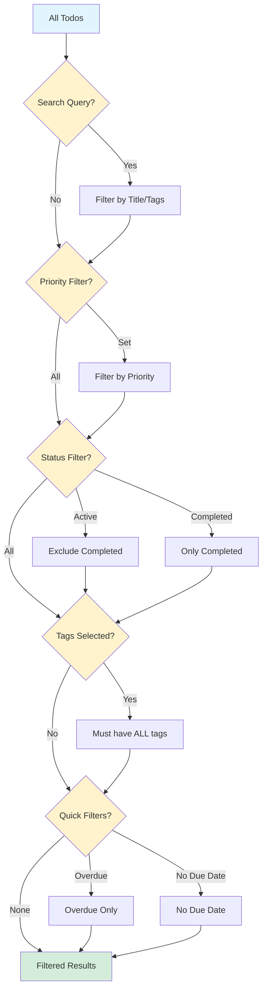

# Search & Filtering Architecture

## Component Hierarchy

```
app/page.tsx (Main Todo Page)
│
├─── SearchBar Component
│    ├── Search Input (debounced)
│    ├── Clear Button
│    └── Keyboard Shortcuts (/, ESC)
│
├─── FilterControls Component
│    ├── Priority Filter (All/High/Medium/Low)
│    ├── Status Filter (All/Active/Completed)
│    ├── Tag Filter (Multi-select with AND logic)
│    ├── Quick Filters (Overdue, No Due Date)
│    └── Clear All Button
│
├─── FilterSummary Component
│    ├── Result Count Display
│    └── Active Filter Badges
│
└─── Todo List (filtered)
     └── TodoCard × N (only filtered todos shown)
```

## Data Flow

```
User Input
    ↓
SearchBar / FilterControls
    ↓
Update State (searchQuery, filters)
    ↓
useDebounce (300ms delay for search)
    ↓
Update FilterState
    ↓
useFilteredTodos (memoized filtering)
    ↓
Filtered Todos Array
    ↓
Render TodoList
```

## State Management

```typescript
// Component State
┌─────────────────────────────────────┐
│ app/page.tsx                        │
├─────────────────────────────────────┤
│ • searchQuery (raw, immediate)      │
│ • filters (FilterState object)      │
│ • todos (all todos from API)        │
│ • tags (all tags from API)          │
└─────────────────────────────────────┘
          ↓
┌─────────────────────────────────────┐
│ useDebounce Hook                    │
├─────────────────────────────────────┤
│ • Delays searchQuery update         │
│ • Returns debouncedSearch           │
└─────────────────────────────────────┘
          ↓
┌─────────────────────────────────────┐
│ useFilteredTodos Hook               │
├─────────────────────────────────────┤
│ Input:                              │
│ • todos: Todo[]                     │
│ • filters: FilterState              │
│                                     │
│ Output:                             │
│ • filteredTodos: Todo[]             │
│                                     │
│ Logic: (all filters use AND)        │
│ 1. Search (title + tags)            │
│ 2. Priority                         │
│ 3. Status                           │
│ 4. Tags (AND logic)                 │
│ 5. Due Date Range                   │
│ 6. Overdue                          │
└─────────────────────────────────────┘
```

## Filter Logic Flow



## Type Definitions

```typescript
// Core Types
type Priority = 'high' | 'medium' | 'low';

interface Tag {
  id: number;
  name: string;
  color: string;
}

interface Todo {
  id: number;
  title: string;
  completed: boolean;
  priority: Priority;
  due_date?: string;
  tags?: Tag[];
}

// Filter State
interface FilterState {
  searchQuery: string;                // From debounced search
  priority: Priority | 'all';         // Priority filter
  status: 'all' | 'active' | 'completed';
  tags: number[];                     // Tag IDs (AND logic)
  dueDateRange: {
    from: string | null;
    to: string | null;
  } | null;
  showOverdue: boolean;
  showNoDueDate: boolean;
}
```

## Component Props

```typescript
// SearchBar
interface SearchBarProps {
  value: string;                      // Current search text
  onChange: (value: string) => void;  // On text change
  onClear: () => void;                // Clear button clicked
  placeholder?: string;               // Optional placeholder
}

// FilterControls
interface FilterControlsProps {
  filters: FilterState;                        // Current filters
  onChange: (updates: Partial<FilterState>) => void;  // Update filters
  onClearAll: () => void;                     // Clear all filters
  availableTags: Tag[];                       // Tags for multi-select
}

// FilterSummary
interface FilterSummaryProps {
  totalCount: number;                 // Total todos
  filteredCount: number;              // Filtered todos
  activeFilters: string[];            // Active filter descriptions
}
```

## Event Flow

```
┌──────────────┐
│ User Types   │ → searchQuery state updates
└──────────────┘
       ↓
┌──────────────┐
│ 300ms delay  │ → useDebounce hook
└──────────────┘
       ↓
┌──────────────┐
│ Update       │ → filters.searchQuery updates
│ FilterState  │
└──────────────┘
       ↓
┌──────────────┐
│ Re-filter    │ → useFilteredTodos recalculates
│ Todos        │   (memoized, only when deps change)
└──────────────┘
       ↓
┌──────────────┐
│ Re-render    │ → TodoList shows new results
│ UI           │
└──────────────┘
       ↓
┌──────────────┐
│ Announce     │ → Screen reader announces count
└──────────────┘
```

## Performance Optimizations

```typescript
// 1. Debouncing (reduce re-renders while typing)
const debouncedSearch = useDebounce(searchQuery, 300);

// 2. Memoization (only recalculate when needed)
const filteredTodos = useMemo(() => {
  // Filtering logic
}, [todos, filters]); // Only runs when todos or filters change

// 3. Stable references (prevent unnecessary re-renders)
const handleFilterChange = useCallback((updates) => {
  setFilters(prev => ({ ...prev, ...updates }));
}, []); // Stable function reference
```

## Accessibility Features

```
┌────────────────────────────────────┐
│ Keyboard Navigation                │
├────────────────────────────────────┤
│ / → Focus search bar               │
│ ESC → Clear search                 │
│ Tab → Navigate filters             │
│ Space/Enter → Activate filter      │
└────────────────────────────────────┘

┌────────────────────────────────────┐
│ Screen Reader Support              │
├────────────────────────────────────┤
│ • aria-label on all inputs         │
│ • aria-pressed on toggle buttons   │
│ • role="status" for announcements  │
│ • aria-live="polite" for results   │
└────────────────────────────────────┘

┌────────────────────────────────────┐
│ Visual Accessibility               │
├────────────────────────────────────┤
│ • WCAG AA contrast ratios          │
│ • Focus indicators on all elements │
│ • Dark mode support                │
│ • Responsive text sizes            │
└────────────────────────────────────┘
```

## File Structure

```
reference-implementation/
├── lib/
│   └── hooks/
│       ├── useDebounce.ts              (35 lines)
│       └── useFilteredTodos.ts         (160 lines)
├── components/
│   ├── SearchBar.tsx                   (120 lines)
│   ├── FilterControls.tsx              (200 lines)
│   └── FilterSummary.tsx               (55 lines)
├── tests/
│   └── 08-search-filtering.spec.ts     (280 lines)
└── example-integration.tsx             (280 lines)

Total: ~1,130 lines of code
```

## Integration Checklist

- [ ] Copy hook files to `lib/hooks/`
- [ ] Copy component files to `components/`
- [ ] Add filter state to `app/page.tsx`
- [ ] Add debouncing logic
- [ ] Add filter handlers
- [ ] Replace `todos` with `filteredTodos` in render
- [ ] Add SearchBar component
- [ ] Add FilterControls component
- [ ] Add FilterSummary component
- [ ] Add empty state handling
- [ ] Test all filter combinations
- [ ] Test keyboard shortcuts
- [ ] Test screen reader announcements
- [ ] Verify dark mode appearance
- [ ] Add E2E tests (optional)

## Common Integration Points

```typescript
// 1. In app/page.tsx, add imports
import { SearchBar } from '@/components/SearchBar';
import { FilterControls } from '@/components/FilterControls';
import { FilterSummary } from '@/components/FilterSummary';
import { useDebounce } from '@/lib/hooks/useDebounce';
import { useFilteredTodos } from '@/lib/hooks/useFilteredTodos';

// 2. Add state
const [searchQuery, setSearchQuery] = useState('');
const [filters, setFilters] = useState<FilterState>({...});

// 3. Add debouncing
const debouncedSearch = useDebounce(searchQuery, 300);

// 4. Add filtering
const filteredTodos = useFilteredTodos(todos, filters);

// 5. Add handlers
const handleFilterChange = (updates: Partial<FilterState>) => {
  setFilters(prev => ({ ...prev, ...updates }));
};

// 6. Render components
<SearchBar value={searchQuery} onChange={setSearchQuery} onClear={...} />
<FilterControls filters={filters} onChange={handleFilterChange} ... />
<FilterSummary totalCount={...} filteredCount={...} ... />
```

---

**Diagram Version**: 1.0  
**Last Updated**: 2026-02-06  
**Format**: Mermaid + ASCII + TypeScript
