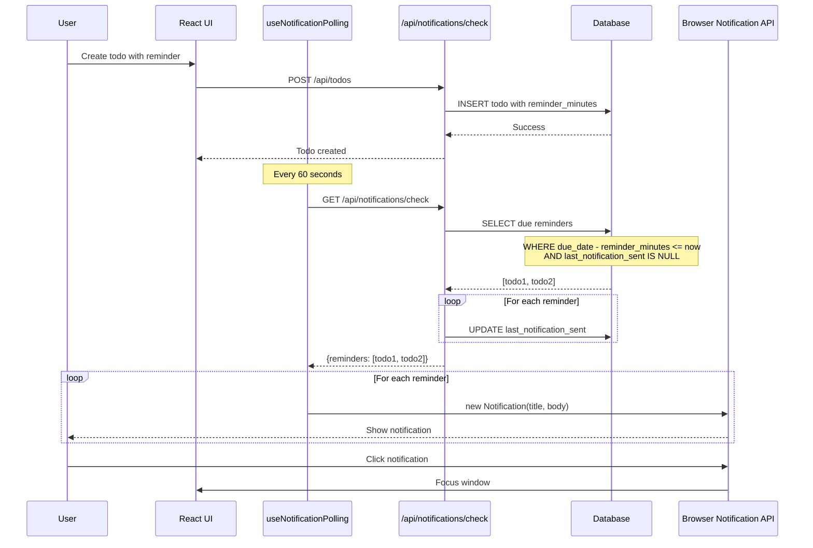
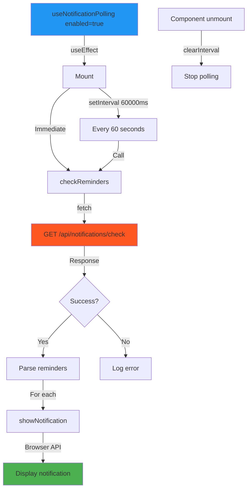
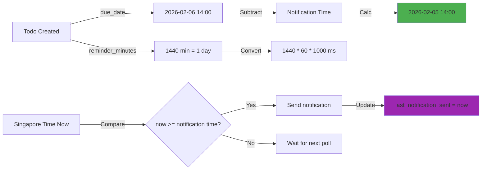
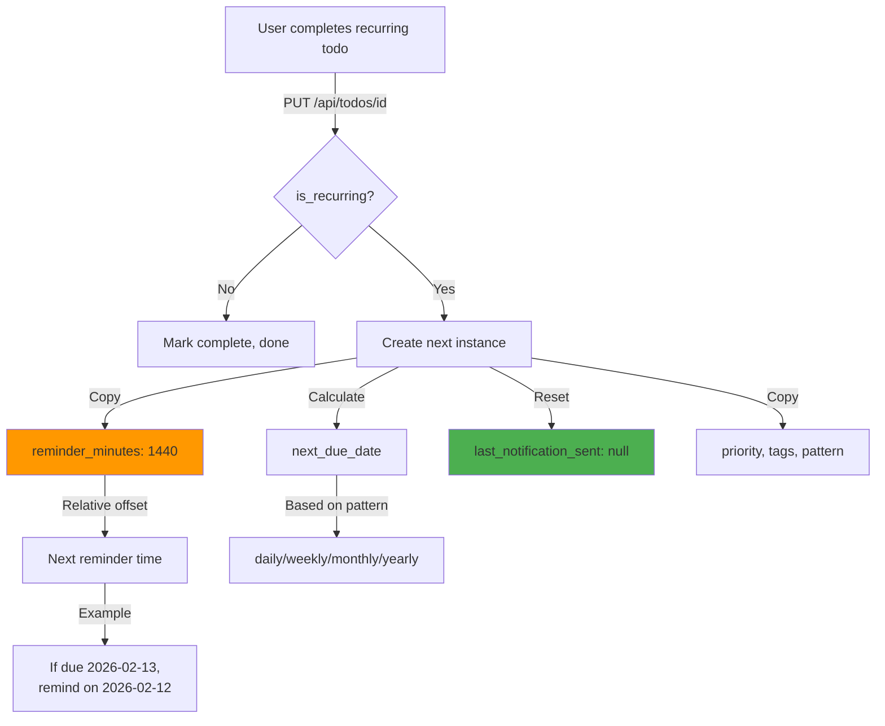
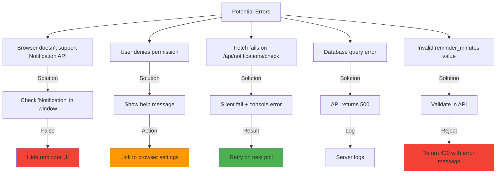
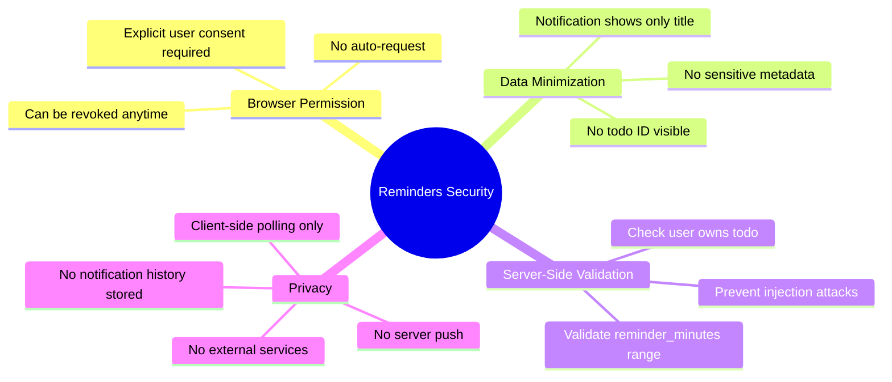
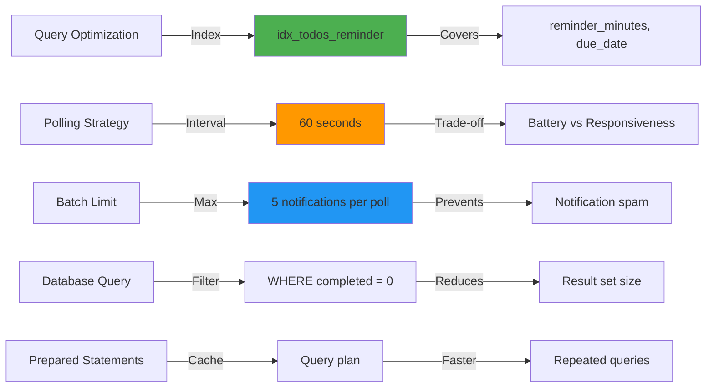
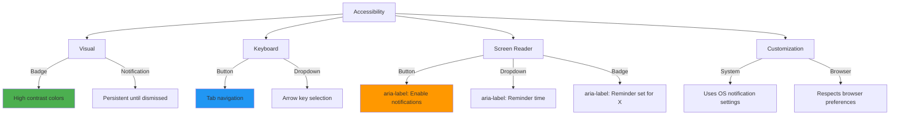
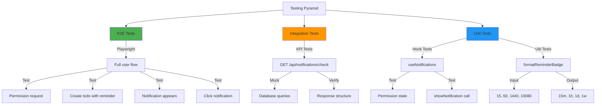

# Reminders & Notifications - Technical Architecture

## System Architecture Diagram

```mermaid
graph TB
    subgraph "Client Layer"
        A[User] -->|1. Clicks Enable| B[Permission Button]
        B -->|2. Requests| C[Browser Notification API]
        C -->|3. Grants| D[useNotifications Hook]
        
        D -->|4. Enabled| E[useNotificationPolling Hook]
        E -->|5. Poll every 60s| F[/api/notifications/check]
        
        G[TodoForm] -->|Set reminder| H[Reminder Dropdown]
        H -->|15m to 1w| I[reminder_minutes state]
        I -->|On submit| J[POST /api/todos]
        
        K[TodoItem] -->|Display| L[🔔 Reminder Badge]
    end
    
    subgraph "API Layer"
        F -->|Auth check| M[getSession]
        M -->|userId| N[todoDB.getDueReminders]
        
        J -->|Create todo| O[todoDB.create]
        O -->|Save| P[(todos table)]
        
        N -->|Query| P
        N -->|Due reminders| Q[Mark as sent]
        Q -->|Update| P
    end
    
    subgraph "Database Layer"
        P -->|Schema| R[reminder_minutes: number]
        P -->|Schema| S[last_notification_sent: string]
        P -->|Index| T[idx_todos_reminder]
    end
    
    subgraph "Notification Flow"
        F -->|Returns| U[{reminders: []}]
        U -->|For each| E
        E -->|Trigger| V[showNotification]
        V -->|Browser API| W[Browser Notification]
        W -->|Click| X[Focus window]
    end
    
    style B fill:#f9a825
    style C fill:#4caf50
    style E fill:#2196f3
    style F fill:#ff5722
    style P fill:#9c27b0
    style W fill:#4caf50
```

---

## Data Flow Sequence



---

## State Machine: Notification Permission

```mermaid
stateDiagram-v2
    [*] --> Checking: Page Load
    
    Checking --> Default: Permission not set
    Checking --> Granted: Permission granted
    Checking --> Denied: Permission denied
    
    Default --> Prompting: User clicks "Enable Notifications"
    Prompting --> Granted: User allows
    Prompting --> Denied: User blocks
    
    Granted --> Polling: Start 60s interval
    Polling --> Granted: Continue polling
    
    Denied --> HelpMessage: Show instructions
    HelpMessage --> Default: User resets in browser
    
    Granted --> Checking: Page refresh
    Denied --> Checking: Page refresh
    
    note right of Polling
        Check /api/notifications/check
        Show browser notifications
        Continue until page closed
    end note
    
    note right of HelpMessage
        Display: "Enable in browser settings"
        Reminder UI remains disabled
    end note
```

---

## Component Architecture

```mermaid
graph LR
    subgraph "Layout (Global)"
        A[app/layout.tsx]
        A -->|Uses| B[useNotifications]
        A -->|Renders| C[Permission Button]
    end
    
    subgraph "Main Page"
        D[app/page.tsx]
        D -->|Uses| B
        D -->|Uses| E[useNotificationPolling]
        D -->|Renders| F[TodoForm]
        D -->|Renders| G[TodoList]
        
        F -->|Contains| H[Reminder Dropdown]
        G -->|Contains| I[TodoItem]
        I -->|Shows| J[🔔 Badge]
    end
    
    subgraph "Hooks"
        B -->|Manages| K[Permission State]
        B -->|Calls| L[Notification API]
        
        E -->|Polls| M[/api/notifications/check]
        E -->|Triggers| B
    end
    
    subgraph "API Routes"
        M -->|Reads| N[lib/db.ts]
        O[/api/todos] -->|Writes| N
        P[/api/todos/id] -->|Updates| N
    end
    
    style A fill:#1976d2
    style D fill:#1976d2
    style B fill:#ff9800
    style E fill:#ff9800
    style M fill:#4caf50
    style N fill:#9c27b0
```

---

## Database Schema Detail

```mermaid
erDiagram
    TODOS {
        int id PK
        int user_id FK
        string title
        datetime due_date
        int reminder_minutes "15, 30, 60, 120, 1440, 2880, 10080, NULL"
        string last_notification_sent "ISO timestamp, NULL"
        bool completed
        bool is_recurring
        string recurrence_pattern
    }
    
    USERS {
        int id PK
        string username
    }
    
    USERS ||--o{ TODOS : owns
    
    TODOS ||--o| NOTIFICATION_CHECK : triggers
    
    NOTIFICATION_CHECK {
        condition "due_date - reminder_minutes <= now"
        condition "last_notification_sent IS NULL"
        condition "completed = 0"
    }
```

**Index Strategy**:
```sql
CREATE INDEX idx_todos_reminder ON todos(reminder_minutes, due_date) 
  WHERE reminder_minutes IS NOT NULL AND completed = 0;
```
- **Why**: Speeds up query for due reminders
- **Filter**: Only incomplete todos with reminders
- **Columns**: Both used in WHERE clause

---

## Polling Mechanism Detail



**Key Decisions**:
- **60 second interval**: Balance between responsiveness and battery/network
- **Immediate check on mount**: Don't wait 60s for first check
- **Error handling**: Silent fail, log to console, don't break UI
- **Cleanup**: Clear interval on unmount to prevent memory leaks

---

## Reminder Time Calculation



**Formula**:
```typescript
const notificationTime = new Date(todo.due_date).getTime() - (todo.reminder_minutes * 60 * 1000);
const shouldNotify = getSingaporeNow().getTime() >= notificationTime 
  && todo.last_notification_sent === null;
```

---

## Recurring Todo Integration



**Critical**: Reminder is a **relative offset**, not an absolute time!
- ❌ Wrong: Copy `last_notification_sent` from parent
- ✅ Correct: Copy `reminder_minutes`, reset `last_notification_sent = null`

---

## Error Handling Strategy



---

## Security & Privacy Considerations



---

## Performance Optimization



**Key Metrics**:
- Query time: < 10ms (with index)
- Polling overhead: ~1% CPU
- Network: ~100 bytes per poll
- Notification delay: 0-60 seconds (average 30s)

---

## Accessibility Features



**WCAG 2.1 AA Compliance**:
- ✅ Color contrast ratio ≥ 4.5:1
- ✅ Keyboard accessible
- ✅ Screen reader friendly
- ✅ No time-based auto-actions (user triggers notification enable)

---

## Testing Strategy



**Test Coverage Goals**:
- E2E: Full user journey (permission → create → notify)
- API: All endpoints + error cases
- Hooks: Permission states + polling behavior
- Utils: Time formatting + calculations

---

**Created**: 2026-02-06  
**Version**: 1.0  
**Based on**: PRPs/04-reminders-notifications.md
