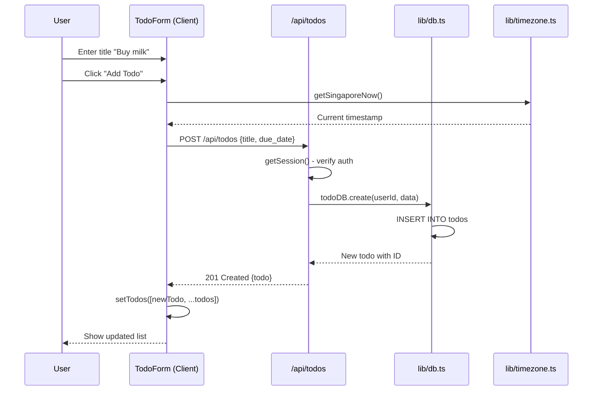
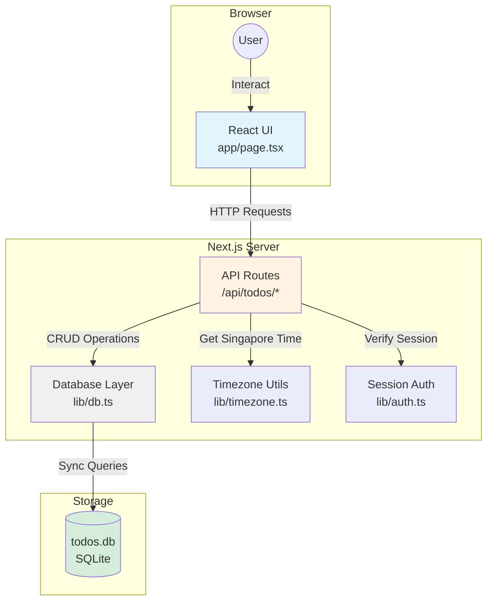
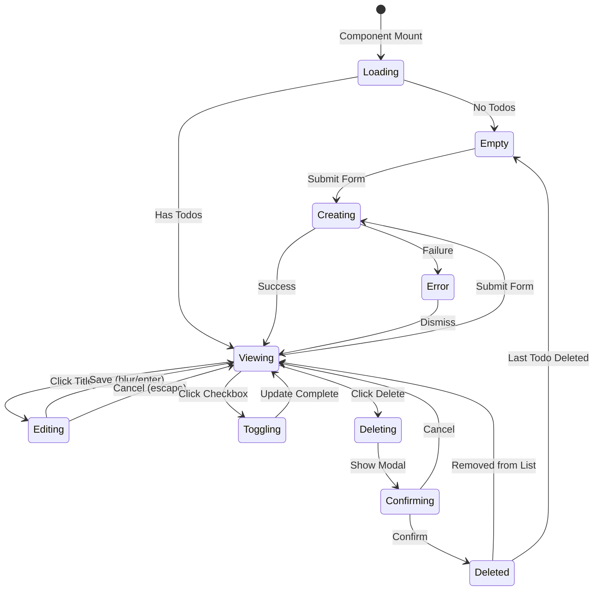

# PRP 01: Todo CRUD Operations - Architecture & System Design

## 1. Feature Summary

**What**: Basic create, read, update, delete (CRUD) operations for todo items with due dates and completion tracking.

**Who**: Authenticated users managing their personal task list.

**Why**: Foundation feature for all todo functionality. Provides core data model and API patterns that other features extend.

**Scope**: Single-user todo management with timezone-aware due dates, completion status, and basic metadata (created/updated timestamps).

## 2. UI/UX Behavior

### Main Todo List View
- **List Display**: Chronological list (newest first) showing:
  - Todo title (text, max 500 chars)
  - Due date (if set) in Singapore timezone
  - Completion checkbox
  - Edit/delete actions
- **Empty State**: "No todos yet. Add your first task above!" with visual prompt
- **Add Form**: Single-line input with "Add Todo" button at top
- **Inline Editing**: Click title to edit in-place, auto-save on blur/enter

### Due Date Selection
- **UI**: Optional datetime-local picker (browser native)
- **Display Format**: "Dec 25, 2026 at 2:30 PM" (Singapore time)
- **Overdue Visual**: Red text for todos past due date

### Error States
- **Network failure**: Toast notification "Failed to save. Retrying..." with auto-retry
- **Validation errors**: Inline error below input (e.g., "Title required")
- **Delete confirmation**: Modal "Delete this todo? This cannot be undone."

## 3. Data Model

### Todo Interface
```typescript
interface Todo {
  id: number;                    // Auto-increment primary key
  user_id: number;               // Foreign key to users table
  title: string;                 // Max 500 chars, required
  completed: boolean;            // Default false
  due_date: string | null;       // ISO 8601 string in Singapore timezone
  created_at: string;            // ISO 8601, auto-generated
  updated_at: string;            // ISO 8601, auto-updated
  
  // Extended in other PRPs:
  // priority?: 'high' | 'medium' | 'low';  // PRP 02
  // recurrence_pattern?: string;            // PRP 03
  // reminder_minutes?: number;              // PRP 04
}
```

### Database Schema
```sql
CREATE TABLE todos (
  id INTEGER PRIMARY KEY AUTOINCREMENT,
  user_id INTEGER NOT NULL,
  title TEXT NOT NULL CHECK(length(title) <= 500),
  completed INTEGER DEFAULT 0 NOT NULL,  -- SQLite boolean (0/1)
  due_date TEXT,                         -- ISO 8601 string
  created_at TEXT NOT NULL DEFAULT (datetime('now')),
  updated_at TEXT NOT NULL DEFAULT (datetime('now')),
  FOREIGN KEY (user_id) REFERENCES users(id) ON DELETE CASCADE
);

CREATE INDEX idx_todos_user_id ON todos(user_id);
CREATE INDEX idx_todos_due_date ON todos(due_date);
```

### Example Records
```json
{
  "id": 1,
  "user_id": 42,
  "title": "Buy groceries",
  "completed": false,
  "due_date": "2026-12-25T14:30:00+08:00",
  "created_at": "2026-12-20T10:00:00+08:00",
  "updated_at": "2026-12-20T10:00:00+08:00"
}
```

```json
{
  "id": 2,
  "user_id": 42,
  "title": "Call dentist",
  "completed": true,
  "due_date": null,
  "created_at": "2026-12-19T09:15:00+08:00",
  "updated_at": "2026-12-20T11:30:00+08:00"
}
```

## 4. Component Impact Map

### New Files
- `app/api/todos/route.ts` - GET (list), POST (create)
- `app/api/todos/[id]/route.ts` - GET (single), PUT (update), DELETE
- `lib/db.ts` - Database initialization and `todoDB` CRUD methods

### Modified Files
- `app/page.tsx` - Main client component for todo list UI
- `lib/timezone.ts` - Singapore timezone utilities (if not exists)

### Component Hierarchy
```
App (page.tsx)
├── TodoForm (inline, new todo input)
├── TodoList
│   └── TodoItem (for each todo)
│       ├── CompletionCheckbox
│       ├── TitleEditor (contentEditable)
│       ├── DueDateDisplay
│       └── DeleteButton
└── EmptyState
```

## 5. State & Data Flow

### State Management Pattern
**Client-side (React hooks in `app/page.tsx`)**:
```typescript
const [todos, setTodos] = useState<Todo[]>([]);
const [newTodoTitle, setNewTodoTitle] = useState('');
const [loading, setLoading] = useState(false);
const [error, setError] = useState<string | null>(null);
```

### Data Flow Diagram


### Optimistic Updates
1. **Add**: Immediately add to local state with temp ID, replace on server response
2. **Toggle completion**: Update UI instantly, revert on error
3. **Delete**: Remove from UI, show undo toast for 3s before committing

## 6. API Specification

### GET /api/todos
**Auth**: Required (session cookie)
**Query Params**: None (filtering added in PRP 08)
**Response**: 200 OK
```json
{
  "todos": [
    {"id": 1, "title": "Task 1", "completed": false, ...},
    {"id": 2, "title": "Task 2", "completed": true, ...}
  ]
}
```

### POST /api/todos
**Auth**: Required
**Body**:
```json
{
  "title": "New task",
  "due_date": "2026-12-25T14:30:00+08:00"  // Optional
}
```
**Response**: 201 Created
```json
{
  "todo": {"id": 3, "title": "New task", ...}
}
```
**Errors**:
- 400 Bad Request: `{"error": "Title is required"}`
- 401 Unauthorized: `{"error": "Not authenticated"}`

### PUT /api/todos/[id]
**Auth**: Required
**Body** (all fields optional):
```json
{
  "title": "Updated title",
  "completed": true,
  "due_date": null
}
```
**Response**: 200 OK `{todo}`
**Errors**:
- 404 Not Found: `{"error": "Todo not found"}`
- 403 Forbidden: If todo belongs to different user

### DELETE /api/todos/[id]
**Auth**: Required
**Response**: 204 No Content
**Errors**: Same as PUT

## 7. Component Specifications

### TodoForm Component (embedded in page.tsx)
**Props**: None
**State**:
- `title: string` - input value
- `dueDate: string | null` - selected date

**Behavior**:
- Submit on Enter or button click
- Clear form after successful creation
- Disable during API call (loading state)
- Focus input after submit

### TodoItem Component
**Props**:
```typescript
{
  todo: Todo;
  onUpdate: (id: number, data: Partial<Todo>) => Promise<void>;
  onDelete: (id: number) => Promise<void>;
}
```

**Features**:
- Click-to-edit title (contentEditable)
- Checkbox for completion toggle
- Due date formatting with overdue indicator
- Delete button with confirmation

## 8. Non-Functional Requirements

### Accessibility
- ✅ **Keyboard navigation**: Tab through todos, Enter to edit, Escape to cancel
- ✅ **Screen readers**: `aria-label="Todo: ${title}"` on each item
- ✅ **Focus management**: Focus new todo input after add, focus next item after delete
- ✅ **Color contrast**: Text meets WCAG AA (4.5:1 for normal text)

### Performance
- ✅ **Initial load**: < 300ms for 100 todos (synchronous SQLite query)
- ✅ **Optimistic updates**: UI responds in < 16ms (instant feedback)
- ✅ **Debounced saves**: Title edits auto-save 500ms after typing stops
- ✅ **Pagination**: Not needed for MVP (assume < 1000 todos per user)

### Security & Privacy
- ✅ **Input sanitization**: React auto-escapes JSX (no XSS)
- ✅ **SQL injection prevention**: Use prepared statements (`db.prepare()`)
- ✅ **User isolation**: All queries filter by `user_id` from session
- ✅ **Rate limiting**: Not implemented in MVP (add if abuse occurs)

### Maintainability
- ✅ **Type safety**: All DB operations return typed interfaces
- ✅ **Single responsibility**: `lib/db.ts` owns all DB logic
- ✅ **Error boundaries**: Top-level try-catch in API routes
- ✅ **Logging**: Console.error for server errors (upgrade to logging service later)

## 9. Database Layer (`lib/db.ts`)

### Export Pattern
```typescript
export const todoDB = {
  // Get all todos for a user (ordered by created_at DESC)
  list(userId: number): Todo[] { ... },
  
  // Get single todo by ID (with user_id check)
  get(id: number, userId: number): Todo | null { ... },
  
  // Create new todo
  create(userId: number, data: { title: string; due_date?: string | null }): Todo { ... },
  
  // Update existing todo
  update(id: number, userId: number, data: Partial<Todo>): Todo | null { ... },
  
  // Delete todo
  delete(id: number, userId: number): boolean { ... },
};
```

### Migration Strategy
```typescript
// In lib/db.ts initialization
db.exec(`
  CREATE TABLE IF NOT EXISTS todos (
    id INTEGER PRIMARY KEY AUTOINCREMENT,
    user_id INTEGER NOT NULL,
    title TEXT NOT NULL CHECK(length(title) <= 500),
    completed INTEGER DEFAULT 0 NOT NULL,
    due_date TEXT,
    created_at TEXT NOT NULL DEFAULT (datetime('now')),
    updated_at TEXT NOT NULL DEFAULT (datetime('now')),
    FOREIGN KEY (user_id) REFERENCES users(id) ON DELETE CASCADE
  );
  CREATE INDEX IF NOT EXISTS idx_todos_user_id ON todos(user_id);
  CREATE INDEX IF NOT EXISTS idx_todos_due_date ON todos(due_date);
`);
```

## 10. Implementation Steps

1. **Database setup** (lib/db.ts):
   - Create `todos` table schema
   - Implement `todoDB` CRUD methods with prepared statements
   - Add timezone helper imports

2. **API routes**:
   - Create `app/api/todos/route.ts` (GET, POST)
   - Create `app/api/todos/[id]/route.ts` (GET, PUT, DELETE)
   - Add session authentication checks
   - Handle Next.js 16 async params pattern

3. **Client UI** (app/page.tsx):
   - Add todo state management hooks
   - Create TodoForm component section
   - Create TodoList rendering logic
   - Implement optimistic updates

4. **Due date handling**:
   - Add datetime-local input to form
   - Use `getSingaporeNow()` for date calculations
   - Display formatted dates with overdue styling

5. **Error handling**:
   - Add try-catch in API routes
   - Implement error state in UI
   - Add toast notifications for feedback

6. **Testing**:
   - Write Playwright test: `tests/02-todo-crud.spec.ts`
   - Test: create, read, update, delete flows
   - Test: due date selection and display
   - Test: empty state and error states

## 11. System Context Diagram



## 12. State Diagram



## 13. Edge Cases & Error Handling

### Input Validation
- **Empty title**: Show error "Title cannot be empty"
- **Title too long (>500)**: Truncate with "..." or show character count
- **Invalid due date**: Browser validation for datetime-local input

### Concurrent Updates
- **Scenario**: User edits todo in two browser tabs
- **Handling**: Last-write-wins (simple approach for MVP)
- **Future**: Implement version field + conflict detection

### Timezone Edge Cases
- **Due date near midnight**: Use Singapore timezone consistently
- **User travels**: All dates stored/displayed as Singapore time (not user local)
- **Daylight saving**: Singapore has no DST (UTC+8 year-round)

### Network Errors
- **Offline**: Show toast "You're offline. Changes will sync when reconnected."
- **Server error (500)**: Show "Something went wrong. Try again." with retry button
- **Timeout**: Auto-retry up to 3 times with exponential backoff

### Database Constraints
- **User deleted**: Todos cascade delete (ON DELETE CASCADE)
- **Duplicate IDs**: Impossible (AUTOINCREMENT primary key)
- **Null user_id**: Prevented by NOT NULL constraint

## 14. Acceptance Criteria

### Functional
- ✅ User can create todo with title only
- ✅ User can create todo with title + due date
- ✅ User can view list of all todos (newest first)
- ✅ User can toggle todo completion status
- ✅ User can edit todo title inline
- ✅ User can delete todo with confirmation
- ✅ Empty state shows when no todos exist
- ✅ Overdue todos display in red

### Technical
- ✅ All dates use Singapore timezone
- ✅ Session authentication required for all endpoints
- ✅ User can only access their own todos (enforced server-side)
- ✅ Optimistic UI updates provide instant feedback
- ✅ Database operations use prepared statements

### Accessibility
- ✅ All interactive elements keyboard accessible
- ✅ Screen reader announces todo count and status
- ✅ Focus management works correctly

## 15. Testing Strategy

### E2E Tests (Playwright)
**File**: `tests/02-todo-crud.spec.ts`

```typescript
test('create todo with title only', async ({ page }) => {
  // Login first
  await page.goto('/');
  await page.fill('[placeholder="What needs to be done?"]', 'Buy milk');
  await page.click('text=Add Todo');
  await expect(page.locator('text=Buy milk')).toBeVisible();
});

test('create todo with due date', async ({ page }) => {
  // Select due date from datetime picker
  // Verify date displays correctly in Singapore time
});

test('toggle completion status', async ({ page }) => {
  // Create todo, click checkbox
  // Verify completed styling
  // Uncheck, verify uncompleted styling
});

test('edit todo title', async ({ page }) => {
  // Create todo
  // Click title to edit
  // Type new title, press Enter
  // Verify updated
});

test('delete todo with confirmation', async ({ page }) => {
  // Create todo
  // Click delete button
  // Expect confirmation modal
  // Confirm deletion
  // Verify removed from list
});

test('empty state displays correctly', async ({ page }) => {
  // Delete all todos
  // Verify empty state message
});
```

### Unit Tests (if applicable)
- `lib/db.ts`: Test CRUD methods with mock database
- `lib/timezone.ts`: Test date formatting functions

## 16. Out of Scope (Phase 2+)

- ❌ Priority levels (see PRP 02)
- ❌ Recurring todos (see PRP 03)
- ❌ Reminders/notifications (see PRP 04)
- ❌ Subtasks (see PRP 05)
- ❌ Tags (see PRP 06)
- ❌ Search/filtering (see PRP 08)
- ❌ Undo/redo functionality
- ❌ Drag-and-drop reordering
- ❌ Collaborative features (shared todos)

## 17. Success Metrics

- ✅ **E2E test coverage**: 100% of CRUD operations
- ✅ **API response time**: < 100ms for typical operations
- ✅ **Error rate**: < 1% of requests fail
- ✅ **User action latency**: Optimistic updates feel instant (< 16ms)

## 18. Migration & Rollout

### Database Migration
No migration needed (first feature). Future features add columns:
```sql
-- Example for PRP 02 (priority)
ALTER TABLE todos ADD COLUMN priority TEXT DEFAULT 'medium';
```

### Rollback Plan
Drop `todos` table and recreate (acceptable for MVP with small user base).

---

**Version**: 1.0  
**Last Updated**: 2026-02-06  
**Dependencies**: Authentication (PRP 11 - can be added last for demo)  
**Depends On**: None (foundation feature)
