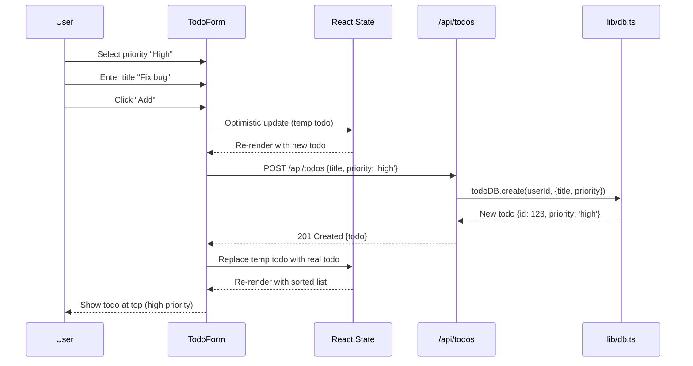
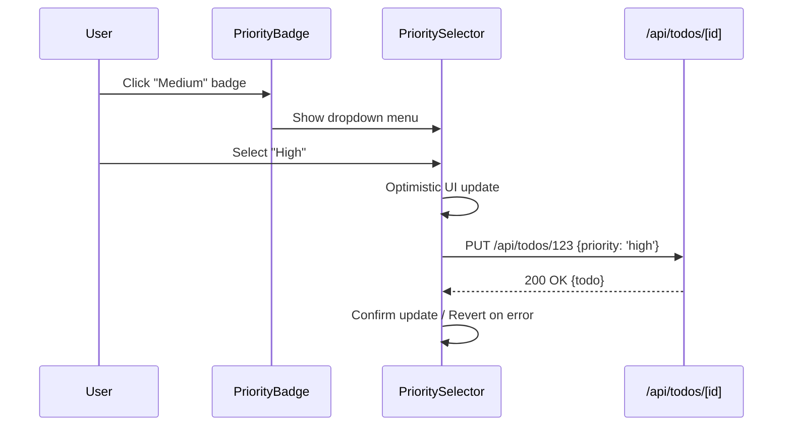
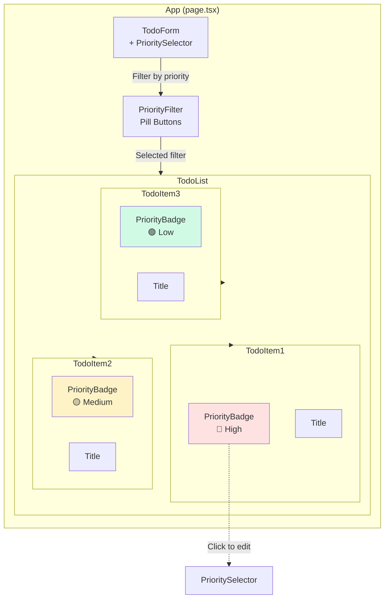
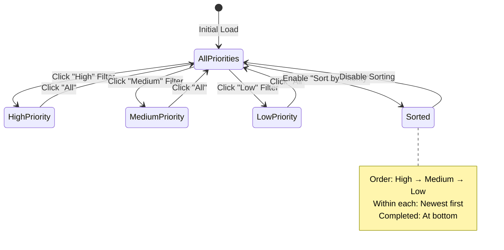

# PRP 02: Priority System - Architecture & System Design

## 1. Feature Summary

**What**: Three-level priority system (High, Medium, Low) for todos with visual color coding and automatic sorting.

**Who**: Users organizing tasks by urgency and importance.

**Why**: Helps users focus on high-priority tasks first through visual distinction and smart ordering.

**Scope**: Priority badge display, inline priority selector, automatic sorting (high → medium → low), and filtering by priority level.

## 2. UI/UX Behavior

### Priority Badge Display
- **Visual Design**: 
  - High: Red badge (🔴 #EF4444) with "High" text
  - Medium: Yellow badge (🟡 #F59E0B) with "Medium" text
  - Low: Green badge (🟢 #10B981) with "Low" text
- **Position**: Left of todo title, before checkbox
- **Size**: Small (px: 6-8pt text, 2px padding)

### Priority Selection
- **On Create**: Dropdown in todo form (default: Medium)
- **On Edit**: Click badge to show inline dropdown menu
  - Options: High, Medium, Low
  - Immediate update on selection (optimistic)

### Automatic Sorting
- **Default Order**: 
  1. Incomplete todos: High → Medium → Low (within each, newest first)
  2. Completed todos: At bottom, same priority order
- **User Control**: Toggle "Sort by priority" on/off (stored in localStorage)

### Filter by Priority
- **UI**: Three pill buttons above todo list
  - "All" (default, active state highlighted)
  - "High", "Medium", "Low" (show count badges)
- **Behavior**: Click to filter, click again to deselect (return to All)

### Empty States
- **No high priority todos**: "No high-priority tasks. Great job!" (when filtered to High)
- **All completed**: "All [priority] tasks completed! 🎉"

## 3. Data Model

### Extended Todo Interface
```typescript
type Priority = 'high' | 'medium' | 'low';

interface Todo {
  id: number;
  user_id: number;
  title: string;
  completed: boolean;
  due_date: string | null;
  priority: Priority;           // NEW: Required, default 'medium'
  created_at: string;
  updated_at: string;
  
  // From other PRPs:
  // recurrence_pattern?: string;
  // reminder_minutes?: number;
}
```

### Database Schema Change
```sql
-- Migration: Add priority column to existing todos table
ALTER TABLE todos ADD COLUMN priority TEXT DEFAULT 'medium' NOT NULL
  CHECK(priority IN ('high', 'medium', 'low'));

-- Index for efficient filtering and sorting
CREATE INDEX idx_todos_priority ON todos(priority);
```

### Example Records
```json
{
  "id": 1,
  "title": "Fix critical bug",
  "priority": "high",
  "completed": false,
  "due_date": "2026-12-25T17:00:00+08:00"
}
```

```json
{
  "id": 2,
  "title": "Update documentation",
  "priority": "low",
  "completed": false,
  "due_date": null
}
```

## 4. Component Impact Map

### Modified Files
- `lib/db.ts`:
  - Add `priority` field to `Todo` interface
  - Update `todoDB.create()` to accept priority (default 'medium')
  - Update `todoDB.list()` to support priority sorting
  - Add `todoDB.listByPriority(userId, priority)` method
- `app/page.tsx`:
  - Add PriorityBadge component
  - Add PrioritySelector dropdown to TodoForm
  - Add PriorityFilter pills above todo list
  - Implement sorting logic
  - Add localStorage for sort preference
- `app/api/todos/route.ts`:
  - Accept `priority` in POST body
  - Return todos with priority field
- `app/api/todos/[id]/route.ts`:
  - Accept `priority` in PUT body

### New Components
```
PriorityBadge
├── Props: { priority: Priority, onClick?: () => void }
└── Renders: Color-coded pill

PrioritySelector
├── Props: { value: Priority, onChange: (p: Priority) => void }
└── Renders: Dropdown menu (High/Medium/Low)

PriorityFilter
├── Props: { selected: Priority | 'all', onChange: (p) => void }
└── Renders: Pill buttons with counts
```

## 5. State & Data Flow

### State Management
```typescript
// In app/page.tsx
const [todos, setTodos] = useState<Todo[]>([]);
const [priorityFilter, setPriorityFilter] = useState<Priority | 'all'>('all');
const [sortByPriority, setSortByPriority] = useState<boolean>(() => {
  return localStorage.getItem('sortByPriority') === 'true';
});

// Derived state (computed)
const filteredTodos = useMemo(() => {
  let result = todos;
  
  // Apply priority filter
  if (priorityFilter !== 'all') {
    result = result.filter(t => t.priority === priorityFilter);
  }
  
  // Apply priority sorting
  if (sortByPriority) {
    result = result.sort((a, b) => {
      // Completed todos go to bottom
      if (a.completed !== b.completed) return a.completed ? 1 : -1;
      
      // Priority order: high > medium > low
      const priorityOrder = { high: 0, medium: 1, low: 2 };
      if (a.priority !== b.priority) {
        return priorityOrder[a.priority] - priorityOrder[b.priority];
      }
      
      // Within same priority, newest first
      return new Date(b.created_at).getTime() - new Date(a.created_at).getTime();
    });
  }
  
  return result;
}, [todos, priorityFilter, sortByPriority]);
```

### Data Flow Diagram


### Priority Change Flow


## 6. API Specification

### POST /api/todos (Modified)
**Body**:
```json
{
  "title": "New task",
  "priority": "high",          // NEW: Optional, default 'medium'
  "due_date": "2026-12-25T14:30:00+08:00"
}
```

### PUT /api/todos/[id] (Modified)
**Body**:
```json
{
  "priority": "low"            // NEW: Can update priority independently
}
```

### GET /api/todos (Modified)
**Query Params** (optional):
- `priority=high|medium|low` - Filter by priority
- `sort=priority` - Enable priority sorting (alternative: client-side)

**Response**:
```json
{
  "todos": [
    {"id": 1, "title": "Critical task", "priority": "high", ...},
    {"id": 2, "title": "Regular task", "priority": "medium", ...}
  ]
}
```

## 7. Component Specifications

### PriorityBadge Component
```typescript
interface PriorityBadgeProps {
  priority: Priority;
  onClick?: () => void;
  size?: 'sm' | 'md';
}

// Renders:
// <span className="px-2 py-1 rounded-full text-xs bg-[color]">
//   {priority.charAt(0).toUpperCase() + priority.slice(1)}
// </span>
```

**Styling**:
- High: `bg-red-500 text-white`
- Medium: `bg-yellow-500 text-white`
- Low: `bg-green-500 text-white`
- Hover: `cursor-pointer hover:opacity-80` (if onClick provided)

### PrioritySelector Component
```typescript
interface PrioritySelectorProps {
  value: Priority;
  onChange: (priority: Priority) => void;
  disabled?: boolean;
}

// Renders dropdown with three options
// Uses headlessui Menu component or native <select>
```

### PriorityFilter Component
```typescript
interface PriorityFilterProps {
  todos: Todo[];
  selected: Priority | 'all';
  onChange: (filter: Priority | 'all') => void;
}

// Computes counts:
const counts = {
  all: todos.length,
  high: todos.filter(t => t.priority === 'high').length,
  medium: todos.filter(t => t.priority === 'medium').length,
  low: todos.filter(t => t.priority === 'low').length,
};

// Renders pill buttons with badge counts
```

## 8. Non-Functional Requirements

### Accessibility
- ✅ **Color + text**: Priority conveyed via both color AND text (not color alone)
- ✅ **Keyboard navigation**: Arrow keys to navigate priority selector dropdown
- ✅ **Screen readers**: `aria-label="Priority: High"` on badges
- ✅ **Focus indicators**: Visible focus ring on priority selector

### Performance
- ✅ **Client-side sorting**: No extra API calls, instant re-sort
- ✅ **Memoization**: Use `useMemo` for filtered/sorted todos (avoid re-compute on every render)
- ✅ **Local storage**: Persist sort preference (< 1KB data)

### Security & Privacy
- ✅ **Input validation**: Priority must be one of three valid values (enum)
- ✅ **SQL injection**: Use CHECK constraint + prepared statements
- ✅ **No sensitive data**: Priority level is not privacy-sensitive

### Maintainability
- ✅ **Type safety**: `Priority` type enforced in TypeScript
- ✅ **Centralized colors**: Define color constants in component or CSS
- ✅ **Reusable components**: PriorityBadge used in list + detail views

## 9. Database Migration

### Migration Script (add to lib/db.ts)
```typescript
// Run on app startup (idempotent)
try {
  db.exec(`
    -- Add priority column if not exists
    ALTER TABLE todos ADD COLUMN priority TEXT DEFAULT 'medium' NOT NULL
      CHECK(priority IN ('high', 'medium', 'low'));
  `);
} catch (e) {
  // Column already exists (safe to ignore)
}

// Add index
db.exec(`
  CREATE INDEX IF NOT EXISTS idx_todos_priority ON todos(priority);
`);

// Backfill existing todos (set all to 'medium')
db.prepare(`
  UPDATE todos SET priority = 'medium' WHERE priority IS NULL
`).run();
```

### Rollback
```sql
-- Remove priority column (SQLite doesn't support DROP COLUMN directly)
-- Workaround: Create new table without column, copy data, rename
-- Not recommended for MVP - easier to drop/recreate database
```

## 10. Implementation Steps

1. **Update database schema** (lib/db.ts):
   - Add priority column migration
   - Update `Todo` interface with `priority: Priority`
   - Add index on priority column

2. **Update database methods**:
   - Modify `todoDB.create()` to accept priority (default 'medium')
   - Update `todoDB.list()` to include priority sorting option
   - Add validation for priority enum values

3. **Create PriorityBadge component**:
   - Define color mappings (high=red, medium=yellow, low=green)
   - Add hover/click interaction for editing
   - Test accessibility (color contrast, screen readers)

4. **Create PrioritySelector component**:
   - Build dropdown with three options
   - Handle keyboard navigation (arrow keys)
   - Add focus management

5. **Update TodoForm**:
   - Add priority dropdown (default: Medium)
   - Include priority in POST request body
   - Update optimistic UI to include priority

6. **Update TodoItem display**:
   - Render PriorityBadge before title
   - Make badge clickable to show selector
   - Handle priority update API call

7. **Implement priority filtering**:
   - Create PriorityFilter component with pill buttons
   - Add counts for each priority level
   - Wire up filter state to todo list

8. **Implement priority sorting**:
   - Add sort toggle button (checkbox or toggle switch)
   - Persist preference in localStorage
   - Apply sort in useMemo hook

9. **Update API routes**:
   - Accept priority in POST /api/todos
   - Accept priority in PUT /api/todos/[id]
   - Add validation for priority values

10. **Testing**:
    - Write E2E tests for priority CRUD
    - Test filtering and sorting
    - Test accessibility (keyboard, screen reader)

## 11. Component Diagram



## 12. State Diagram



## 13. Edge Cases & Error Handling

### Invalid Priority Values
- **Input**: User manually edits API request with priority "urgent"
- **Handling**: API returns 400 Bad Request "Invalid priority. Must be high, medium, or low."
- **Database**: CHECK constraint prevents invalid values

### Priority Migration for Existing Todos
- **Scenario**: App deployed with existing todos (no priority field)
- **Handling**: Migration sets all existing todos to 'medium' (neutral default)
- **User experience**: Users can manually update priority after migration

### Sort Persistence Edge Cases
- **Different browser**: Sort preference stored per browser (localStorage)
- **Incognito mode**: Preference resets on close (acceptable)
- **Future**: Sync preference to user profile (requires backend field)

### Filter + Search Interaction
- **Scenario**: User filters by "High" AND searches for "meeting"
- **Handling**: Apply both filters (intersection: high-priority todos with "meeting" in title)
- **UI**: Show both active filters with separate clear buttons

### Completed Todo Sorting
- **Scenario**: User completes high-priority todo
- **Handling**: Todo moves to bottom of list (completed section)
- **Visual**: Strike-through text + faded priority badge

## 14. Acceptance Criteria

### Functional
- ✅ User can set priority when creating todo (default: Medium)
- ✅ User can change priority by clicking badge (shows dropdown)
- ✅ Priority displayed as color-coded badge (red/yellow/green)
- ✅ User can filter todos by priority (All, High, Medium, Low)
- ✅ User can toggle "Sort by priority" (high → medium → low)
- ✅ Sort preference persists across page reloads (localStorage)
- ✅ Completed todos appear at bottom regardless of priority

### Visual
- ✅ High priority: Red badge (#EF4444)
- ✅ Medium priority: Yellow badge (#F59E0B)
- ✅ Low priority: Green badge (#10B981)
- ✅ Badge text is readable (WCAG AA contrast)

### Technical
- ✅ Priority stored in database with CHECK constraint
- ✅ API validates priority values (enum: high/medium/low)
- ✅ Existing todos migrated to 'medium' priority
- ✅ Sorting and filtering performed client-side (no extra API calls)

## 15. Testing Strategy

### E2E Tests (Playwright)
**File**: `tests/03-priority-system.spec.ts`

```typescript
test('create todo with high priority', async ({ page }) => {
  await page.goto('/');
  await page.fill('[placeholder="What needs to be done?"]', 'Urgent task');
  await page.selectOption('select[name="priority"]', 'high');
  await page.click('text=Add Todo');
  
  const badge = page.locator('text=Urgent task').locator('..').locator('.badge');
  await expect(badge).toHaveText('High');
  await expect(badge).toHaveCSS('background-color', 'rgb(239, 68, 68)');
});

test('change todo priority', async ({ page }) => {
  // Create medium priority todo
  // Click badge to open dropdown
  // Select "High"
  // Verify badge updates to red
});

test('filter by high priority', async ({ page }) => {
  // Create todos: 2 high, 1 medium, 1 low
  // Click "High" filter pill
  // Expect 2 todos visible
  // Expect medium/low todos hidden
});

test('sort by priority', async ({ page }) => {
  // Create todos: low, high, medium (in that order)
  // Enable "Sort by priority"
  // Expect order: high, medium, low
  // Reload page
  // Expect sorting still enabled (localStorage)
});

test('completed todos appear at bottom', async ({ page }) => {
  // Create high-priority todo
  // Complete it
  // Create low-priority todo (uncompleted)
  // Expect low-priority todo above completed high-priority
});
```

### Unit Tests
```typescript
describe('priority sorting logic', () => {
  test('sorts incomplete todos by priority', () => {
    const todos = [
      { priority: 'low', completed: false },
      { priority: 'high', completed: false },
      { priority: 'medium', completed: false },
    ];
    const sorted = sortByPriority(todos);
    expect(sorted.map(t => t.priority)).toEqual(['high', 'medium', 'low']);
  });
  
  test('places completed todos at bottom', () => {
    const todos = [
      { priority: 'high', completed: true },
      { priority: 'low', completed: false },
    ];
    const sorted = sortByPriority(todos);
    expect(sorted[0].completed).toBe(false);
    expect(sorted[1].completed).toBe(true);
  });
});
```

## 16. Out of Scope (Phase 2+)

- ❌ Custom priority levels (beyond high/medium/low)
- ❌ Priority-based due date suggestions
- ❌ Auto-escalate priority as due date approaches
- ❌ Priority statistics/analytics dashboard
- ❌ Eisenhower matrix view (urgent/important quadrants)
- ❌ Sync sort preference to user profile (requires DB field)

## 17. Success Metrics

- ✅ **E2E test coverage**: 100% of priority operations (set, change, filter, sort)
- ✅ **Visual consistency**: All priority badges use correct colors across app
- ✅ **Performance**: Sorting 100 todos < 10ms (client-side computation)
- ✅ **Accessibility**: WCAG AA compliance for color contrast and keyboard navigation

## 18. Dependencies & Integration

### Depends On
- **PRP 01 (Todo CRUD)**: Extends todo data model and UI

### Enables
- **PRP 08 (Search & Filtering)**: Priority filter integrates with other filters
- **Future analytics**: Priority distribution charts

### Integration Points
- **PRP 03 (Recurring Todos)**: Next instance inherits priority from parent todo
- **PRP 04 (Reminders)**: Consider priority when scheduling notifications (future enhancement)
- **PRP 09 (Export/Import)**: Include priority field in JSON export

---

**Version**: 1.0  
**Last Updated**: 2026-02-06  
**Status**: Ready for implementation
