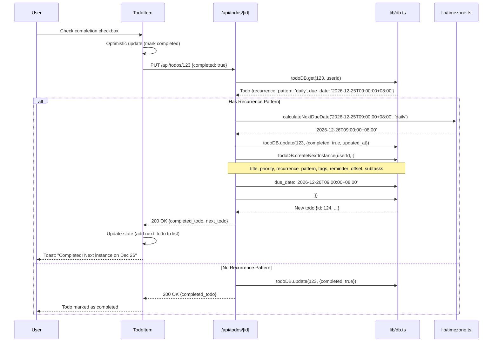
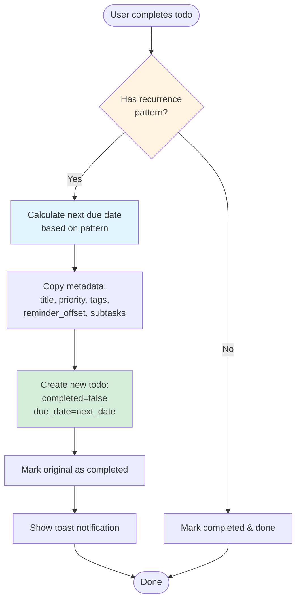

# PRP 03: Recurring Todos - Architecture & System Design

## 1. Feature Summary

**What**: Automatic creation of next todo instance when recurring todo is completed, supporting daily, weekly, monthly, and yearly recurrence patterns.

**Who**: Users with repetitive tasks (daily standups, weekly reports, monthly bills, yearly reviews).

**Why**: Eliminates manual re-creation of repeating tasks, ensures routine tasks aren't forgotten.

**Scope**: Four recurrence patterns (daily/weekly/monthly/yearly), automatic next-instance generation on completion, due date calculation based on pattern, and metadata inheritance (priority, tags, reminder offset, subtasks).

## 2. UI/UX Behavior

### Creating Recurring Todo
- **UI**: Checkbox "Repeat" in todo form (below due date picker)
- **Pattern Selector**: Dropdown appears when "Repeat" checked
  - Options: "Daily", "Weekly", "Monthly", "Yearly"
- **Visual Indicator**: Recurring icon (🔁) badge next to todo title in list
- **Required**: Due date MUST be set for recurring todos (validation error if not)

### Completing Recurring Todo
- **Action**: User checks completion checkbox
- **Behavior (automatic)**:
  1. Mark current instance as completed
  2. Calculate next due date based on pattern
  3. Create new todo instance with:
     - Same title
     - Same priority
     - Same tags (if any)
     - Same reminder offset (if set)
     - Same subtasks (unchecked, if any)
     - New due date (calculated)
     - `completed: false`
  4. Show toast: "Completed! Next instance created for [date]"

### Editing Recurring Todo
- **Change pattern**: Updates current instance only (does NOT retroactively change past/future instances)
- **Stop recurrence**: Uncheck "Repeat" → Becomes one-time todo
- **Edit title/priority**: Updates current instance only

### Visual Display
- **List View**: 
  - Todo title with 🔁 badge
  - Pattern label: "(Daily)", "(Weekly)", etc. in gray text
  - Due date in Singapore timezone
- **Completed Recurring Todos**: 
  - Shown in completed section (strike-through)
  - Next instance appears in active list

## 3. Data Model

### Extended Todo Interface
```typescript
type RecurrencePattern = 'daily' | 'weekly' | 'monthly' | 'yearly' | null;

interface Todo {
  id: number;
  user_id: number;
  title: string;
  completed: boolean;
  due_date: string | null;          
  priority: Priority;
  recurrence_pattern: RecurrencePattern;  // NEW: null for one-time todos
  created_at: string;
  updated_at: string;
  
  // Note: No parent_id tracking (each instance is independent)
  // From other PRPs:
  // reminder_minutes?: number;
  // subtasks?: Subtask[];
  // tags?: Tag[];
}
```

### Database Schema Change
```sql
-- Migration: Add recurrence_pattern column
ALTER TABLE todos ADD COLUMN recurrence_pattern TEXT 
  CHECK(recurrence_pattern IN ('daily', 'weekly', 'monthly', 'yearly') OR recurrence_pattern IS NULL);

CREATE INDEX idx_todos_recurrence ON todos(recurrence_pattern);
```

### Example Records
```json
{
  "id": 1,
  "title": "Daily standup",
  "recurrence_pattern": "daily",
  "due_date": "2026-12-25T09:00:00+08:00",
  "completed": false,
  "priority": "medium"
}
```

```json
{
  "id": 2,
  "title": "Daily standup",
  "recurrence_pattern": "daily",
  "due_date": "2026-12-24T09:00:00+08:00",
  "completed": true,
  "priority": "medium"
}
```
*(Todo #2 was completed, creating Todo #1 for next day)*

### Due Date Calculation Logic
```typescript
function calculateNextDueDate(currentDueDate: string, pattern: RecurrencePattern): string {
  const date = new Date(currentDueDate);  // Parse as Singapore time
  
  switch (pattern) {
    case 'daily':
      date.setDate(date.getDate() + 1);
      break;
    case 'weekly':
      date.setDate(date.getDate() + 7);
      break;
    case 'monthly':
      date.setMonth(date.getMonth() + 1);
      // Edge case: Jan 31 + 1 month = Feb 28/29 (last valid day)
      break;
    case 'yearly':
      date.setFullYear(date.getFullYear() + 1);
      break;
  }
  
  return date.toISOString();  // Return as ISO 8601
}
```

## 4. Component Impact Map

### Modified Files
- `lib/db.ts`:
  - Add `recurrence_pattern` field to `Todo` interface
  - Update `todoDB.create()` to accept recurrence_pattern
  - Add `todoDB.createNextInstance()` method (duplicates todo with new due date)
- `app/page.tsx`:
  - Add "Repeat" checkbox to TodoForm
  - Add RecurrencePatternSelector dropdown
  - Add 🔁 badge rendering in TodoItem
  - Update completion handler to create next instance
- `app/api/todos/route.ts`:
  - Accept `recurrence_pattern` in POST body
- `app/api/todos/[id]/route.ts`:
  - Handle recurrence logic in PUT (completion)
  - Create next instance if `completed: true` and `recurrence_pattern` exists

### New Components
```
RecurrenceBadge
├── Props: { pattern: RecurrencePattern }
└── Renders: 🔁 icon + "(Daily)" label

RecurrenceSelector
├── Props: { value: RecurrencePattern, onChange: (p) => void, disabled?: boolean }
└── Renders: Checkbox + Dropdown (Daily/Weekly/Monthly/Yearly)
```

## 5. State & Data Flow

### Completion Flow Diagram


### Next Instance Creation Logic


## 6. API Specification

### POST /api/todos (Modified)
**Body**:
```json
{
  "title": "Daily standup",
  "due_date": "2026-12-25T09:00:00+08:00",
  "recurrence_pattern": "daily",      // NEW: Optional (null for one-time)
  "priority": "medium"
}
```

**Validation**:
- If `recurrence_pattern` is set, `due_date` is required (400 Bad Request if missing)

### PUT /api/todos/[id] (Modified)
**Body (completion scenario)**:
```json
{
  "completed": true
}
```

**Response** (if recurring):
```json
{
  "completed_todo": {
    "id": 123,
    "title": "Daily standup",
    "completed": true,
    "recurrence_pattern": "daily"
  },
  "next_todo": {
    "id": 124,
    "title": "Daily standup",
    "completed": false,
    "due_date": "2026-12-26T09:00:00+08:00",
    "recurrence_pattern": "daily",
    "priority": "medium"
  }
}
```

**Response** (if one-time):
```json
{
  "completed_todo": {
    "id": 123,
    "title": "Buy groceries",
    "completed": true
  }
}
```

### PUT /api/todos/[id] (edit recurrence pattern)
**Body**:
```json
{
  "recurrence_pattern": "weekly"  // Change from daily to weekly
}
```
Updates current instance only (does NOT cascade to past/future instances).

## 7. Component Specifications

### RecurrenceBadge Component
```typescript
interface RecurrenceBadgeProps {
  pattern: RecurrencePattern;
}

// Renders:
// 🔁 <span className="text-gray-500 text-sm">(Daily)</span>
```

### RecurrenceSelector Component
```typescript
interface RecurrenceSelectorProps {
  value: RecurrencePattern;
  onChange: (pattern: RecurrencePattern) => void;
  disabled?: boolean;
  hasDueDate: boolean;  // Show warning if false
}

// Renders:
// <label>
//   <input type="checkbox" checked={value !== null} />
//   Repeat
// </label>
// {value !== null && (
//   <select>
//     <option value="daily">Daily</option>
//     <option value="weekly">Weekly</option>
//     <option value="monthly">Monthly</option>
//     <option value="yearly">Yearly</option>
//   </select>
// )}
// {value !== null && !hasDueDate && (
//   <span className="text-red-500">Due date required for recurring todos</span>
// )}
```

### TodoForm Updates
```typescript
// Add state
const [isRecurring, setIsRecurring] = useState(false);
const [recurrencePattern, setRecurrencePattern] = useState<'daily' | 'weekly' | 'monthly' | 'yearly'>('daily');

// Validation before submit
if (isRecurring && !dueDate) {
  setError('Due date is required for recurring todos');
  return;
}
```

## 8. Non-Functional Requirements

### Accessibility
- ✅ **Clear labeling**: "Repeat" checkbox with `aria-label="Enable recurring"`
- ✅ **Pattern selection**: Dropdown keyboard navigable (arrow keys)
- ✅ **Visual + text**: 🔁 icon + text label (not icon alone)
- ✅ **Toast announcements**: Screen reader announces "Completed! Next instance created" via `aria-live="polite"`

### Performance
- ✅ **Next instance creation**: < 50ms (single DB insert)
- ✅ **No cascade updates**: Independent instances (no recursive queries)
- ✅ **Optimistic UI**: Checkbox toggles instantly, next instance added to state on response

### Security & Privacy
- ✅ **Input validation**: Recurrence pattern enum check (daily/weekly/monthly/yearly)
- ✅ **User isolation**: Next instance created with same `user_id`
- ✅ **No infinite loops**: Each completion creates exactly one new todo (not recursive)

### Maintainability
- ✅ **Date calculation isolated**: `calculateNextDueDate()` in `lib/timezone.ts`
- ✅ **Copy logic centralized**: `todoDB.createNextInstance()` handles all metadata inheritance
- ✅ **Type safety**: `RecurrencePattern` type enforced

## 9. Database Migration

```typescript
// In lib/db.ts initialization
try {
  db.exec(`
    ALTER TABLE todos ADD COLUMN recurrence_pattern TEXT 
      CHECK(recurrence_pattern IN ('daily', 'weekly', 'monthly', 'yearly') OR recurrence_pattern IS NULL);
  `);
} catch (e) {
  // Column already exists
}

db.exec(`
  CREATE INDEX IF NOT EXISTS idx_todos_recurrence ON todos(recurrence_pattern);
`);
```

## 10. Implementation Steps

1. **Update database schema**:
   - Add `recurrence_pattern` column (nullable, CHECK constraint)
   - Add index on `recurrence_pattern`

2. **Add date calculation utility** (lib/timezone.ts):
   - Implement `calculateNextDueDate(currentDate, pattern)`
   - Handle edge cases (month-end dates, leap years)
   - Test with Singapore timezone

3. **Update database methods** (lib/db.ts):
   - Add `recurrence_pattern` to `Todo` interface
   - Update `todoDB.create()` to accept pattern
   - Implement `todoDB.createNextInstance()`:
     ```typescript
     createNextInstance(userId: number, originalTodo: Todo, nextDueDate: string): Todo {
       // Copy title, priority, recurrence_pattern
       // Copy tags (if any) - requires tag relationship copy
       // Copy reminder_offset (not absolute time)
       // Copy subtasks (unchecked) - requires subtask duplication
       // Set new due_date, completed=false
     }
     ```

4. **Create RecurrenceBadge component**:
   - Render 🔁 icon + pattern label
   - Conditional rendering (only if pattern exists)

5. **Create RecurrenceSelector component**:
   - Checkbox to enable/disable recurrence
   - Dropdown for pattern selection
   - Validation: require due date if recurring

6. **Update TodoForm** (app/page.tsx):
   - Add RecurrenceSelector below due date picker
   - Add validation: error if recurring without due date
   - Include `recurrence_pattern` in POST request

7. **Update TodoItem display**:
   - Render RecurrenceBadge next to title (if pattern exists)
   - Show pattern label: "(Daily)", "(Weekly)", etc.

8. **Update completion handler** (app/api/todos/[id]/route.ts):
   - Check if `completed: true` AND `recurrence_pattern` exists
   - Calculate next due date
   - Create next instance with metadata inheritance
   - Return both completed todo and next todo in response

9. **Update UI optimistic updates**:
   - On completion response, add `next_todo` to state
   - Show toast notification with next due date
   - Scroll to new todo (optional UX enhancement)

10. **Testing**:
    - E2E test: Create daily recurring todo → Complete → Verify next instance
    - Test: Weekly pattern creates todo 7 days later
    - Test: Monthly pattern handles month-end correctly (Jan 31 → Feb 28)
    - Test: Yearly pattern handles leap years
    - Test: Metadata inheritance (priority, tags, subtasks)

## 11. Date Calculation Edge Cases

### Monthly Recurrence (End of Month)
**Problem**: Jan 31 + 1 month = Feb 31 (invalid)
**Solution**: JavaScript `Date.setMonth()` automatically adjusts to last valid day (Feb 28/29)

**Example**:
```typescript
const date = new Date('2026-01-31T10:00:00+08:00');
date.setMonth(date.getMonth() + 1);
// Result: '2026-02-28T10:00:00+08:00' (NOT error)
```

**Test Cases**:
- Jan 31 → Feb 28 (non-leap year) ✅
- Jan 31 → Feb 29 (leap year) ✅
- Aug 31 → Sep 30 ✅

### Yearly Recurrence (Leap Year)
**Problem**: Feb 29, 2024 + 1 year = Feb 29, 2025 (invalid)
**Solution**: JavaScript `Date.setFullYear()` adjusts to Feb 28

**Example**:
```typescript
const date = new Date('2024-02-29T10:00:00+08:00');
date.setFullYear(date.getFullYear() + 1);
// Result: '2025-02-28T10:00:00+08:00'
```

### Daylight Saving Time (DST)
**Not applicable**: Singapore uses UTC+8 year-round (no DST)

### Time Zone Consistency
**All dates stored and calculated in Singapore timezone** (`Asia/Singapore`).
Use `getSingaporeNow()` from `lib/timezone.ts` for current time.

## 12. System Diagram

```mermaid
graph TB
    subgraph "UI Layer (app/page.tsx)"
        TodoForm[TodoForm<br/>+ RecurrenceSelector]
        TodoList[TodoList]
        TodoItem[TodoItem<br/>+ RecurrenceBadge]
    end
    
    subgraph "API Layer"
        POST[POST /api/todos<br/>Create with pattern]
        PUT[PUT /api/todos/[id]<br/>Complete & create next]
    end
    
    subgraph "Business Logic (lib/)"
        TZ[timezone.ts<br/>calculateNextDueDate()]
        DB[db.ts<br/>createNextInstance()]
    end
    
    subgraph "Database"
        Todos[(todos table<br/>+ recurrence_pattern)]
    end
    
    TodoForm -->|Create recurring| POST
    TodoItem -->|Complete| PUT
    
    POST --> DB
    PUT --> TZ
    TZ --> DB
    DB --> Todos
    
    PUT -.->|Return next_todo| TodoList
    TodoList --> TodoItem
    
    style TZ fill:#e1f5ff
    style DB fill:#f0f0f0
    style Todos fill:#d4edda
```

## 13. Edge Cases & Error Handling

### Due Date Required for Recurring Todos
- **Scenario**: User checks "Repeat" without selecting due date
- **Handling**: Show error "Due date is required for recurring todos" (prevent submit)
- **UI**: Highlight due date picker with red border

### Changing Pattern After Creation
- **Scenario**: User changes daily todo to weekly
- **Handling**: Update current instance only (no retroactive changes)
- **Future instances**: Will use new pattern when completed

### Stopping Recurrence
- **Scenario**: User unchecks "Repeat" on recurring todo
- **Handling**: Set `recurrence_pattern = null`, no more instances created
- **Existing instances**: Already created todos remain (independent)

### Completing Old Recurring Instance
- **Scenario**: User has two instances of "Daily standup" (Dec 25 and Dec 26), completes Dec 25 after Dec 26 already exists
- **Handling**: Only mark Dec 25 as completed (do NOT create duplicate Dec 26)
- **Implementation**: Check if next instance already exists before creating (optional safeguard)

### Metadata Inheritance Complexity
- **Tags**: Copy tag relationships to new todo (requires `todoDB.copyTags(fromId, toId)`)
- **Subtasks**: Copy subtasks with `completed: false` (requires `todoDB.copySubtasks(fromId, toId)`)
- **Reminder**: Copy reminder OFFSET (e.g., "1 day before"), not absolute time

### Next Instance in the Past
- **Scenario**: User completes overdue recurring todo (due date was yesterday)
- **Handling**: Next instance still calculated from original due date
  - Example: Complete "Daily standup" due yesterday 9am → Next instance tomorrow 9am (NOT today 9am)
- **Alternative**: Add "catch-up" logic to skip to today (future enhancement)

### Concurrent Completions
- **Scenario**: User completes recurring todo in two browser tabs simultaneously
- **Handling**: Database race condition may create duplicate next instances
- **Mitigation**: Client-side optimistic locking (check `updated_at` timestamp) OR accept duplicates (user can delete)

## 14. Acceptance Criteria

### Functional
- ✅ User can create todo with recurrence pattern (daily/weekly/monthly/yearly)
- ✅ Recurring todos require due date (validation error if missing)
- ✅ Recurring todos display 🔁 badge and pattern label
- ✅ Completing recurring todo creates next instance with:
  - Same title, priority, recurrence pattern
  - Same tags (if any)
  - Same reminder offset (if set)
  - Same subtasks (unchecked, if any)
  - New due date (calculated based on pattern)
  - `completed: false`
- ✅ User can change recurrence pattern (updates current instance only)
- ✅ User can stop recurrence (uncheck "Repeat")
- ✅ Completed recurring todos shown in completed section
- ✅ Next instance appears in active todo list

### Technical
- ✅ Date calculation handles month-end edge cases (Jan 31 → Feb 28)
- ✅ Date calculation handles leap years (Feb 29 → Feb 28 next year)
- ✅ All dates use Singapore timezone
- ✅ Next instance creation < 50ms
- ✅ Metadata inheritance works for tags, subtasks, reminder offset

### UX
- ✅ Toast notification shows next due date: "Completed! Next instance on [date]"
- ✅ Optimistic UI: Checkbox toggles instantly
- ✅ Next instance added to list immediately (no page reload)

## 15. Testing Strategy

### E2E Tests (Playwright)
**File**: `tests/04-recurring-todos.spec.ts`

```typescript
test('create daily recurring todo', async ({ page }) => {
  await page.goto('/');
  await page.fill('[placeholder="What needs to be done?"]', 'Daily standup');
  await page.fill('input[type="datetime-local"]', '2026-12-25T09:00');
  await page.check('input[name="is-recurring"]');
  await page.selectOption('select[name="recurrence-pattern"]', 'daily');
  await page.click('text=Add Todo');
  
  // Verify badge
  await expect(page.locator('text=Daily standup').locator('..').locator('text=🔁')).toBeVisible();
  await expect(page.locator('text=(Daily)')).toBeVisible();
});

test('completing recurring todo creates next instance', async ({ page }) => {
  // Create daily recurring todo with due date Dec 25, 9am
  await page.goto('/');
  await page.fill('[placeholder="What needs to be done?"]', 'Team meeting');
  await page.fill('input[type="datetime-local"]', '2026-12-25T09:00');
  await page.check('input[name="is-recurring"]');
  await page.selectOption('select[name="recurrence-pattern"]', 'daily');
  await page.click('text=Add Todo');
  
  // Complete it
  await page.locator('text=Team meeting').locator('..').locator('input[type="checkbox"]').check();
  
  // Verify toast notification
  await expect(page.locator('text=Next instance on Dec 26')).toBeVisible();
  
  // Verify completed todo in completed section
  await expect(page.locator('.completed-section').locator('text=Team meeting')).toBeVisible();
  
  // Verify next instance in active list with due date Dec 26
  const activeTodo = page.locator('.active-section').locator('text=Team meeting');
  await expect(activeTodo).toBeVisible();
  await expect(activeTodo.locator('..').locator('text=Dec 26')).toBeVisible();
});

test('weekly recurrence creates todo 7 days later', async ({ page }) => {
  // Create weekly todo due Dec 25
  // Complete it
  // Verify next instance due Jan 1 (7 days later)
});

test('monthly recurrence handles month-end correctly', async ({ page }) => {
  // Create monthly todo due Jan 31, 10am
  // Complete it
  // Verify next instance due Feb 28, 10am (NOT Feb 31)
});

test('metadata inheritance works', async ({ page }) => {
  // Create high-priority recurring todo with tag "work"
  // Add subtask "Prepare slides"
  // Set reminder "1 day before"
  // Complete it
  // Verify next instance has:
  //   - Priority: High
  //   - Tag: "work"
  //   - Subtask: "Prepare slides" (unchecked)
  //   - Reminder: "1 day before" (new due date)
});

test('stopping recurrence works', async ({ page }) => {
  // Create recurring todo
  // Edit it, uncheck "Repeat"
  // Complete it
  // Verify NO next instance created
});
```

### Unit Tests (Date Calculation)
```typescript
import { calculateNextDueDate } from '@/lib/timezone';

describe('calculateNextDueDate', () => {
  test('daily: adds 1 day', () => {
    const next = calculateNextDueDate('2026-12-25T09:00:00+08:00', 'daily');
    expect(next).toBe('2026-12-26T09:00:00+08:00');
  });
  
  test('weekly: adds 7 days', () => {
    const next = calculateNextDueDate('2026-12-25T09:00:00+08:00', 'weekly');
    expect(next).toBe('2027-01-01T09:00:00+08:00');
  });
  
  test('monthly: Jan 31 → Feb 28', () => {
    const next = calculateNextDueDate('2026-01-31T10:00:00+08:00', 'monthly');
    expect(next).toBe('2026-02-28T10:00:00+08:00');
  });
  
  test('yearly: Feb 29 → Feb 28 (leap year to non-leap)', () => {
    const next = calculateNextDueDate('2024-02-29T10:00:00+08:00', 'yearly');
    expect(next).toBe('2025-02-28T10:00:00+08:00');
  });
});
```

## 16. Out of Scope (Phase 2+)

- ❌ Custom recurrence intervals (every 2 weeks, every 3 months)
- ❌ Specific day-of-week recurrence (every Monday, last Friday of month)
- ❌ Recurrence end date ("repeat until Dec 31, 2027")
- ❌ Recurrence count limit ("repeat 10 times")
- ❌ Skip/postpone next instance
- ❌ "Catch-up" logic (skip overdue instances, create next from today)
- ❌ Bulk edit all instances of recurring series
- ❌ Parent-child relationship tracking (link instances)
- ❌ Recurrence exceptions (skip specific dates, e.g., holidays)

## 17. Success Metrics

- ✅ **E2E test coverage**: 100% of recurrence patterns (daily/weekly/monthly/yearly)
- ✅ **Date accuracy**: All edge cases handled (month-end, leap year)
- ✅ **Metadata inheritance**: 100% (priority, tags, subtasks, reminder offset)
- ✅ **Performance**: Next instance creation < 50ms

## 18. Dependencies & Integration

### Depends On
- **PRP 01 (Todo CRUD)**: Extends todo model
- **PRP 02 (Priority)**: Priority inherited by next instance

### Integrates With
- **PRP 04 (Reminders)**: Reminder offset inherited (e.g., "1 day before" applies to new due date)
- **PRP 05 (Subtasks)**: Subtasks copied to next instance (unchecked)
- **PRP 06 (Tags)**: Tags copied to next instance
- **PRP 09 (Export/Import)**: Recurrence pattern included in JSON export

### Enables
- **Future**: Recurring template patterns (create template from recurring todo)

---

**Version**: 1.0  
**Last Updated**: 2026-02-06  
**Status**: Ready for implementation  
**Implementation Note**: Implement AFTER subtasks and tags for full metadata inheritance
