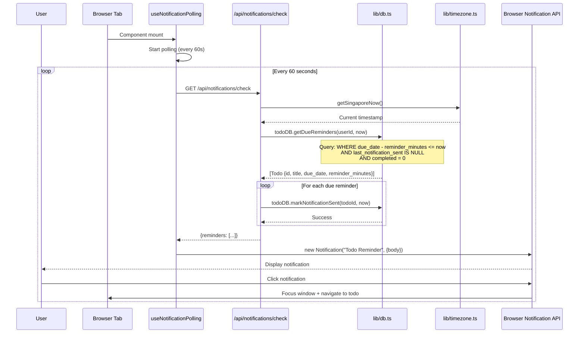

# PRP 04: Reminders & Notifications - Architecture & System Design

## 1. Feature Summary

**What**: Browser-based push notifications for todos with configurable reminder timing (15 minutes to 1 week before due date).

**Who**: Users who want proactive alerts for upcoming tasks.

**Why**: Prevents missed deadlines through timely notifications, even when app isn't actively open.

**Scope**: Browser notification API integration, polling mechanism for due date checking, configurable reminder offsets, duplicate prevention, and Singapore timezone-aware calculations.

## 2. UI/UX Behavior

### Notification Permission
- **First-time**: "Enable Notifications" button in header (prominent, blue)
- **On click**: Browser prompts for notification permission
- **Granted**: Button changes to "Notifications Enabled" (green checkmark)
- **Denied**: Button shows "Notifications Blocked" with help link

### Setting Reminder
- **UI**: Dropdown in todo form (below due date)
  - Options: "None", "15 minutes before", "30 minutes before", "1 hour before", "2 hours before", "1 day before", "2 days before", "1 week before"
- **Visual Indicator**: 🔔 bell icon badge next to todo title (if reminder set)
- **Required**: Due date must be set to enable reminder dropdown

### Notification Display
- **Browser Notification**:
  - Title: "📋 Todo Reminder"
  - Body: "{todo_title} is due in {time_remaining}"
  - Icon: App icon/favicon
  - Click action: Focus app window and navigate to todo
- **Timing**: Notification appears at (due_date - reminder_offset)
- **Frequency**: Once per todo (tracked via `last_notification_sent`)

### Notification Settings Page (Optional)
- **UI**: Link in header/settings
- **Options**: 
  - Enable/disable notifications globally
  - Test notification button
  - Clear notification history

## 3. Data Model

### Extended Todo Interface
```typescript
interface Todo {
  // ... existing fields
  reminder_minutes: number | null;      // NEW: Minutes before due_date (15, 30, 60, 120, 1440, 2880, 10080)
  last_notification_sent: string | null; // NEW: ISO timestamp (prevent duplicates)
}
```

### Database Schema Change
```sql
ALTER TABLE todos ADD COLUMN reminder_minutes INTEGER;
ALTER TABLE todos ADD COLUMN last_notification_sent TEXT;

CREATE INDEX idx_todos_reminder ON todos(reminder_minutes, due_date) 
  WHERE reminder_minutes IS NOT NULL AND completed = 0;
```

### Reminder Offset Mapping
```typescript
const REMINDER_OPTIONS = [
  { label: 'None', value: null },
  { label: '15 minutes before', value: 15 },
  { label: '30 minutes before', value: 30 },
  { label: '1 hour before', value: 60 },
  { label: '2 hours before', value: 120 },
  { label: '1 day before', value: 1440 },  // 24 * 60
  { label: '2 days before', value: 2880 },  // 48 * 60
  { label: '1 week before', value: 10080 }, // 7 * 24 * 60
];
```

## 4. Component Impact Map

### New Files
- `app/api/notifications/check/route.ts` - GET endpoint to check due reminders
- `lib/hooks/useNotifications.ts` - React hook for notification management
- `lib/hooks/useNotificationPolling.ts` - Polling logic (every 60 seconds)

### Modified Files
- `lib/db.ts`:
  - Add `reminder_minutes`, `last_notification_sent` to `Todo` interface
  - Add `todoDB.getDueReminders(userId)` method
  - Add `todoDB.markNotificationSent(todoId, timestamp)` method
- `app/page.tsx`:
  - Add ReminderSelector to TodoForm
  - Add useNotificationPolling hook
  - Add 🔔 badge rendering in TodoItem
- `app/layout.tsx`:
  - Add "Enable Notifications" button in header
  - Add useNotifications hook for permission management

## 5. State & Data Flow

### Notification Flow Diagram


### Permission Flow
```mermaid
stateDiagram-v2
    [*] --> Default: Initial State
    
    Default --> Prompting: Click "Enable Notifications"
    Prompting --> Granted: User allows
    Prompting --> Denied: User blocks
    
    Granted --> Enabled: Notifications active
    Denied --> Blocked: Show help message
    
    Blocked --> Prompting: User resets in browser
    
    note right of Enabled
        Poll every 60s
        Send notifications
    end note
    
    note right of Blocked
        Show "Unblock in settings"
        Disable reminder UI
    end note
```

## 6. API Specification

### GET /api/notifications/check
**Auth**: Required (session cookie)
**Response**: 200 OK
```json
{
  "reminders": [
    {
      "id": 123,
      "title": "Team meeting",
      "due_date": "2026-12-25T14:30:00+08:00",
      "reminder_minutes": 15
    }
  ]
}
```

**Logic**:
1. Get current Singapore time
2. Query todos WHERE:
   - `user_id = session.userId`
   - `completed = 0`
   - `reminder_minutes IS NOT NULL`
   - `due_date - reminder_minutes <= now`
   - `last_notification_sent IS NULL`
3. For each result, mark `last_notification_sent = now`
4. Return list of reminders

### POST /api/todos (Modified)
**Body**:
```json
{
  "title": "Team meeting",
  "due_date": "2026-12-25T14:30:00+08:00",
  "reminder_minutes": 15
}
```

### PUT /api/todos/[id] (Modified)
**Body**:
```json
{
  "reminder_minutes": 1440  // Change to 1 day before
}
```

## 7. Non-Functional Requirements

### Accessibility
- ✅ **Visual + auditory**: Notification uses both system visual and optional sound
- ✅ **Persistent**: Notification stays until dismissed (if browser supports)
- ✅ **Clear action**: Clicking notification navigates to specific todo

### Performance
- ✅ **Polling interval**: 60 seconds (balance between responsiveness and battery)
- ✅ **Query optimization**: Index on `(reminder_minutes, due_date, completed)`
- ✅ **Batch notifications**: Send up to 5 per poll cycle (prevent spam)

### Security & Privacy
- ✅ **User consent**: Require explicit permission grant
- ✅ **Data minimization**: Notifications show only todo title (no sensitive metadata)
- ✅ **Client-side polling**: No server push (simpler, no websockets)

### Maintainability
- ✅ **Polling abstraction**: `useNotificationPolling` hook (reusable)
- ✅ **Graceful degradation**: App works without notifications (optional feature)

## 8. Implementation Steps

1. **Database migration**:
   - Add `reminder_minutes`, `last_notification_sent` columns
   - Add composite index for query optimization

2. **Notification API route**:
   - Implement `GET /api/notifications/check`
   - Query logic: find due reminders
   - Mark `last_notification_sent` to prevent duplicates

3. **Notification hook** (`lib/hooks/useNotifications.ts`):
   - Check browser support (`window.Notification`)
   - Request permission
   - Show notification helper function

4. **Polling hook** (`lib/hooks/useNotificationPolling.ts`):
   - `setInterval` every 60 seconds
   - Call `/api/notifications/check`
   - Trigger browser notifications for results

5. **UI components**:
   - ReminderSelector dropdown in TodoForm
   - 🔔 badge in TodoItem
   - "Enable Notifications" button in layout

6. **Recurring todo integration**:
   - Copy `reminder_minutes` to next instance (offset, not absolute time)
   - Reset `last_notification_sent = null` for new instance

7. **Testing**:
   - E2E test with virtual time (fast-forward clock)
   - Test duplicate prevention
   - Test notification click navigation

## 9. Acceptance Criteria

- ✅ User can request notification permission
- ✅ User can set reminder when creating todo (if due date set)
- ✅ User can change reminder on existing todo
- ✅ Browser notification appears at correct time (due_date - reminder_offset)
- ✅ Notification shows todo title and time remaining
- ✅ Clicking notification focuses app and navigates to todo
- ✅ Duplicate notifications prevented (once per todo)
- ✅ Recurring todos: Next instance inherits reminder offset (not absolute time)
- ✅ Completed todos don't send notifications

## 10. Out of Scope

- ❌ Email/SMS notifications
- ❌ Push notifications (service worker, offline)
- ❌ Multiple reminders per todo
- ❌ Snooze functionality
- ❌ Custom reminder messages
- ❌ Notification history log
- ❌ Smart reminder timing (ML-based)

---

**Version**: 1.0  
**Last Updated**: 2026-02-06  
**Status**: Ready for implementation
