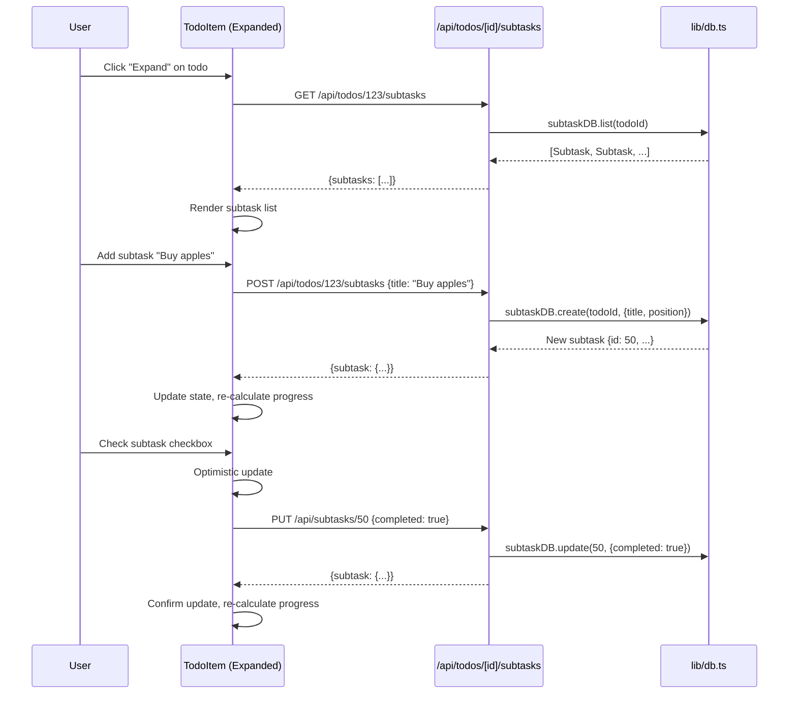

# PRP 05: Subtasks & Progress Tracking - Architecture & System Design

## 1. Feature Summary

**What**: Checklist functionality within todos, with visual progress bars showing completion percentage.

**Who**: Users breaking down complex tasks into manageable steps.

**Why**: Provides granular tracking, motivates through visible progress, and reduces overwhelm for multi-step tasks.

**Scope**: Add/edit/delete/reorder subtasks, checkbox completion, progress bar (X/Y completed), cascade delete on parent todo deletion, and position management for ordering.

## 2. UI/UX Behavior

### Subtask Display
- **Collapsed State** (default): Todo row shows progress bar if subtasks exist
  - "2/5 completed (40%)" with visual progress bar
  - Click todo title or expand icon (▶) to expand
- **Expanded State**: Shows full subtask list below todo
  - Each subtask: checkbox + text + delete button
  - "Add subtask" input field at bottom
  - Collapse icon (▼) to collapse

### Adding Subtasks
- **UI**: Text input field in expanded todo section
- **Action**: Type text, press Enter or click "+" button
- **Position**: New subtasks added at bottom (auto-increment position)
- **Empty state**: "No subtasks yet. Add one below."

### Editing Subtasks
- **Click-to-edit**: Click subtask text to edit inline
- **Save**: Blur or press Enter to save
- **Cancel**: Press Escape to cancel

### Deleting Subtasks
- **Action**: Click delete icon (🗑) next to subtask
- **Confirmation**: None (instant delete, can undo if needed - future enhancement)

### Reordering Subtasks
- **MVP**: Manual position editing (future: drag-and-drop)
- **Implementation**: Subtasks displayed in `position` order (0, 1, 2, ...)

### Progress Bar
- **Visual**: Horizontal bar, filled portion blue (#3B82F6)
- **Text**: "X/Y completed (Z%)"
- **Empty state**: "0/3 completed (0%)" - gray bar
- **Complete state**: "3/3 completed (100%)" - green bar

## 3. Data Model

### Subtask Interface
```typescript
interface Subtask {
  id: number;                  // Auto-increment primary key
  todo_id: number;             // Foreign key to todos
  title: string;               // Max 200 chars
  completed: boolean;          // Default false
  position: number;            // Order within todo (0, 1, 2, ...)
  created_at: string;
}
```

### Database Schema
```sql
CREATE TABLE subtasks (
  id INTEGER PRIMARY KEY AUTOINCREMENT,
  todo_id INTEGER NOT NULL,
  title TEXT NOT NULL CHECK(length(title) <= 200),
  completed INTEGER DEFAULT 0 NOT NULL,
  position INTEGER NOT NULL DEFAULT 0,
  created_at TEXT NOT NULL DEFAULT (datetime('now')),
  FOREIGN KEY (todo_id) REFERENCES todos(id) ON DELETE CASCADE
);

CREATE INDEX idx_subtasks_todo_id ON subtasks(todo_id);
CREATE INDEX idx_subtasks_position ON subtasks(todo_id, position);
```

### Todo Interface (Updated)
```typescript
interface Todo {
  // ... existing fields
  subtasks?: Subtask[];  // Populated via JOIN or separate query
  progress?: {           // Computed field (not stored in DB)
    total: number;
    completed: number;
    percentage: number;
  };
}
```

### Example Records
```json
{
  "id": 1,
  "title": "Prepare presentation",
  "completed": false,
  "subtasks": [
    {"id": 10, "todo_id": 1, "title": "Create slides", "completed": true, "position": 0},
    {"id": 11, "todo_id": 1, "title": "Rehearse speech", "completed": false, "position": 1},
    {"id": 12, "todo_id": 1, "title": "Print handouts", "completed": false, "position": 2}
  ],
  "progress": {
    "total": 3,
    "completed": 1,
    "percentage": 33.33
  }
}
```

## 4. Component Impact Map

### New Files
- `app/api/todos/[id]/subtasks/route.ts` - GET (list), POST (create)
- `app/api/subtasks/[id]/route.ts` - PUT (update), DELETE

### Modified Files
- `lib/db.ts`:
  - Add `Subtask` interface
  - Add `subtaskDB` CRUD methods
  - Update `todoDB.list()` to include subtasks (optional JOIN)
  - Add `todoDB.getWithSubtasks(id)` method
- `app/page.tsx`:
  - Add SubtaskList component
  - Add SubtaskItem component
  - Add ProgressBar component
  - Add expand/collapse state management

## 5. State & Data Flow

### Data Flow Diagram


### Progress Calculation
```typescript
function calculateProgress(subtasks: Subtask[]) {
  const total = subtasks.length;
  const completed = subtasks.filter(s => s.completed).length;
  const percentage = total > 0 ? Math.round((completed / total) * 100) : 0;
  
  return { total, completed, percentage };
}
```

## 6. API Specification

### GET /api/todos/[id]/subtasks
**Auth**: Required
**Response**: 200 OK
```json
{
  "subtasks": [
    {"id": 10, "title": "Step 1", "completed": true, "position": 0},
    {"id": 11, "title": "Step 2", "completed": false, "position": 1}
  ]
}
```

### POST /api/todos/[id]/subtasks
**Body**:
```json
{
  "title": "New step"
}
```
**Response**: 201 Created
```json
{
  "subtask": {"id": 12, "title": "New step", "completed": false, "position": 2}
}
```

### PUT /api/subtasks/[id]
**Body**:
```json
{
  "title": "Updated step",
  "completed": true
}
```
**Response**: 200 OK

### DELETE /api/subtasks/[id]
**Response**: 204 No Content

## 7. Component Specifications

### ProgressBar Component
```typescript
interface ProgressBarProps {
  total: number;
  completed: number;
}

// Renders:
// <div className="w-full bg-gray-200 rounded-full h-2">
//   <div className="bg-blue-600 h-2 rounded-full" style={{width: `${percentage}%`}} />
// </div>
// <span className="text-sm text-gray-600">{completed}/{total} completed ({percentage}%)</span>
```

### SubtaskList Component
```typescript
interface SubtaskListProps {
  todoId: number;
  subtasks: Subtask[];
  onUpdate: (subtasks: Subtask[]) => void;
}

// Features:
// - Map over subtasks to render SubtaskItem
// - Add subtask input field
// - Handle add/update/delete operations
```

### SubtaskItem Component
```typescript
interface SubtaskItemProps {
  subtask: Subtask;
  onToggle: (id: number) => void;
  onUpdate: (id: number, title: string) => void;
  onDelete: (id: number) => void;
}

// Features:
// - Checkbox for completion
// - Inline editing (click-to-edit)
// - Delete button
```

## 8. Non-Functional Requirements

### Accessibility
- ✅ **Nested navigation**: Tab through subtasks, Enter to edit, Escape to cancel
- ✅ **Progress announcement**: Screen reader announces "2 of 5 subtasks completed, 40 percent"
- ✅ **Expand/collapse**: `aria-expanded` attribute on todo row

### Performance
- ✅ **Lazy loading**: Fetch subtasks only when todo expanded (not on initial load)
- ✅ **Optimistic updates**: Checkbox toggles instantly
- ✅ **Batch operations**: Reordering updates multiple positions in one DB transaction

### Security & Privacy
- ✅ **Input validation**: Subtask title max 200 chars
- ✅ **User isolation**: Subtasks inherit todo's user_id (via foreign key)
- ✅ **Cascade delete**: Deleting todo deletes all subtasks (ON DELETE CASCADE)

### Maintainability
- ✅ **Position management**: Auto-increment position, no manual reordering in MVP
- ✅ **Type safety**: `Subtask` interface enforced throughout
- ✅ **Reusable components**: ProgressBar used in list view and detail view

## 9. Implementation Steps

1. **Database setup**:
   - Create `subtasks` table with CASCADE delete
   - Add indexes on `todo_id` and `position`

2. **Database methods** (lib/db.ts):
   - `subtaskDB.list(todoId)` - Get all subtasks for todo (ordered by position)
   - `subtaskDB.create(todoId, {title})` - Auto-assign next position
   - `subtaskDB.update(id, data)` - Update title/completed
   - `subtaskDB.delete(id)` - Delete subtask
   - `subtaskDB.getMaxPosition(todoId)` - Helper for auto-increment

3. **API routes**:
   - `GET /api/todos/[id]/subtasks` - List subtasks
   - `POST /api/todos/[id]/subtasks` - Create subtask
   - `PUT /api/subtasks/[id]` - Update subtask
   - `DELETE /api/subtasks/[id]` - Delete subtask

4. **UI components**:
   - Create ProgressBar component
   - Create SubtaskList component
   - Create SubtaskItem component
   - Add expand/collapse state to TodoItem

5. **Recurring todo integration**:
   - Copy subtasks to next instance (all unchecked)
   - Preserve position order

6. **Template integration**:
   - Store subtasks as JSON array in templates
   - Recreate subtasks when using template

7. **Testing**:
   - E2E test: Add/edit/delete subtasks
   - Test: Progress calculation
   - Test: Cascade delete (delete todo deletes subtasks)

## 10. Edge Cases

### Empty Subtasks
- **Display**: "No subtasks. Add one below."
- **Progress**: Hidden (or show "0/0 completed")

### All Subtasks Completed
- **Visual**: Green progress bar (100%)
- **Parent todo**: Does NOT auto-complete (user must manually check)

### Deleting Todo with Subtasks
- **Behavior**: Cascade delete (all subtasks deleted)
- **Confirmation**: Optional modal "This will delete X subtasks"

### Position Conflicts
- **Scenario**: Two subtasks with same position
- **Handling**: Order by position ASC, then by created_at ASC (deterministic)

## 11. Acceptance Criteria

- ✅ User can add subtasks to any todo
- ✅ User can toggle subtask completion
- ✅ User can edit subtask title (click-to-edit)
- ✅ User can delete individual subtasks
- ✅ Progress bar shows X/Y completed with percentage
- ✅ Subtasks displayed in position order
- ✅ Deleting todo deletes all subtasks (cascade)
- ✅ Recurring todos: Next instance copies subtasks (unchecked)
- ✅ Expand/collapse todo to show/hide subtasks

## 12. Out of Scope

- ❌ Drag-and-drop reordering
- ❌ Nested subtasks (sub-sub-tasks)
- ❌ Subtask due dates
- ❌ Subtask assignees
- ❌ Auto-complete parent todo when all subtasks done
- ❌ Subtask templates

---

**Version**: 1.0  
**Last Updated**: 2026-02-06  
**Status**: Ready for implementation
