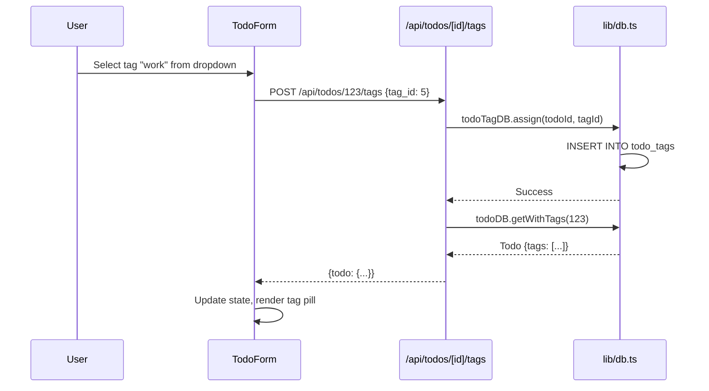

# PRP 06: Tag System - Architecture & System Design

## 1. Feature Summary

**What**: Color-coded labels for categorizing todos with many-to-many relationships (one todo can have multiple tags).

**Who**: Users organizing tasks by project, context, or category (e.g., "work", "personal", "urgent").

**Why**: Enables flexible organization beyond single hierarchy, visual distinction, and powerful filtering capabilities.

**Scope**: Create/read/update/delete tags, assign tags to todos, color customization, tag filtering, and tag management UI.

## 2. UI/UX Behavior

### Tag Display
- **Visual**: Small colored pill badges (e.g., `work` in blue, `urgent` in red)
- **Position**: Below todo title, horizontally aligned
- **Click behavior**: Filter by tag (show only todos with that tag)

### Tag Management Modal
- **Trigger**: "Manage Tags" button in header
- **UI**: Modal/sidebar with:
  - List of existing tags (name + color swatch + delete icon)
  - "Create Tag" form (name input + color picker)
  - Edit tag (click to rename, change color)

### Assigning Tags to Todos
- **On Create**: Multi-select dropdown in todo form
- **On Edit**: Click "Add tag" → Dropdown with existing tags + "Create new" option
- **Remove tag**: Click × on tag pill in todo view

### Tag Color Picker
- **Options**: Predefined palette (8-10 colors) OR custom hex input
- **Palette**: Blue (#3B82F6), Red (#EF4444), Green (#10B981), Yellow (#F59E0B), Purple (#8B5CF6), Pink (#EC4899), Gray (#6B7280), Orange (#F97316)

## 3. Data Model

### Tag Interface
```typescript
interface Tag {
  id: number;
  user_id: number;
  name: string;              // Unique per user, max 30 chars
  color: string;             // Hex color (#RRGGBB)
  created_at: string;
}
```

### TodoTag Junction Table
```sql
CREATE TABLE tags (
  id INTEGER PRIMARY KEY AUTOINCREMENT,
  user_id INTEGER NOT NULL,
  name TEXT NOT NULL CHECK(length(name) <= 30),
  color TEXT NOT NULL CHECK(color GLOB '#[0-9A-Fa-f][0-9A-Fa-f][0-9A-Fa-f][0-9A-Fa-f][0-9A-Fa-f][0-9A-Fa-f]'),
  created_at TEXT NOT NULL DEFAULT (datetime('now')),
  FOREIGN KEY (user_id) REFERENCES users(id) ON DELETE CASCADE,
  UNIQUE(user_id, name)  -- Tag names unique per user
);

CREATE TABLE todo_tags (
  todo_id INTEGER NOT NULL,
  tag_id INTEGER NOT NULL,
  PRIMARY KEY (todo_id, tag_id),
  FOREIGN KEY (todo_id) REFERENCES todos(id) ON DELETE CASCADE,
  FOREIGN KEY (tag_id) REFERENCES tags(id) ON DELETE CASCADE
);

CREATE INDEX idx_tags_user_id ON tags(user_id);
CREATE INDEX idx_todo_tags_todo_id ON todo_tags(todo_id);
CREATE INDEX idx_todo_tags_tag_id ON todo_tags(tag_id);
```

### Todo Interface (Updated)
```typescript
interface Todo {
  // ... existing fields
  tags?: Tag[];  // Populated via JOIN
}
```

## 4. Component Impact Map

### New Files
- `app/api/tags/route.ts` - GET (list), POST (create)
- `app/api/tags/[id]/route.ts` - PUT (update), DELETE
- `app/api/todos/[id]/tags/route.ts` - POST (assign), DELETE (unassign)

### Modified Files
- `lib/db.ts`:
  - Add `Tag` interface
  - Add `tagDB` CRUD methods
  - Add `todoTagDB` for junction table operations
  - Update `todoDB.list()` to include tags (JOIN)
- `app/page.tsx`:
  - Add TagManager modal
  - Add TagPill component
  - Add TagSelector multi-select dropdown

## 5. State & Data Flow

### Tag Assignment Flow


## 6. API Specification

### GET /api/tags
**Response**: `{tags: [{id, name, color}, ...]}`

### POST /api/tags
**Body**: `{name: "work", color: "#3B82F6"}`
**Response**: 201 Created `{tag: {...}}`

### PUT /api/tags/[id]
**Body**: `{name: "Work", color: "#1E40AF"}`

### DELETE /api/tags/[id]
**Response**: 204 No Content (cascade deletes todo_tags entries)

### POST /api/todos/[id]/tags
**Body**: `{tag_id: 5}`
**Response**: 200 OK `{todo: {...}}`

### DELETE /api/todos/[id]/tags/[tag_id]
**Response**: 204 No Content

## 7. Component Specifications

### TagPill Component
```typescript
interface TagPillProps {
  tag: Tag;
  onClick?: () => void;
  onRemove?: () => void;
  size?: 'sm' | 'md';
}

// Renders:
// <span style={{backgroundColor: tag.color}} className="px-2 py-1 rounded-full text-white text-xs">
//   {tag.name}
//   {onRemove && <button>×</button>}
// </span>
```

### TagSelector Component
```typescript
interface TagSelectorProps {
  availableTags: Tag[];
  selectedTags: Tag[];
  onChange: (tags: Tag[]) => void;
  onCreateNew?: (name: string, color: string) => void;
}

// Features:
// - Multi-select dropdown
// - Show selected tags as pills
// - "Create new tag" option at bottom
```

### TagManager Modal
```typescript
// Full-screen modal or sidebar
// Lists all user's tags
// Create/edit/delete operations
// Color picker for each tag
```

## 8. Non-Functional Requirements

### Accessibility
- ✅ **Color + text**: Tags convey meaning via both color AND text
- ✅ **Keyboard navigation**: Arrow keys in tag selector
- ✅ **Screen readers**: `aria-label="Tag: work, color: blue"`

### Performance
- ✅ **JOIN optimization**: Index on `todo_tags.todo_id`
- ✅ **Tag reuse**: Tags shared across todos (not duplicated)

### Security & Privacy
- ✅ **Unique constraint**: Tag names unique per user
- ✅ **Hex color validation**: CHECK constraint in DB + frontend validation

### Maintainability
- ✅ **Junction table pattern**: Standard many-to-many implementation
- ✅ **Cascade deletes**: Deleting tag removes all assignments

## 9. Implementation Steps

1. **Database setup**: Create `tags` and `todo_tags` tables
2. **Tag CRUD APIs**: `/api/tags/*` endpoints
3. **Tag assignment APIs**: `/api/todos/[id]/tags/*` endpoints
4. **UI components**: TagPill, TagSelector, TagManager
5. **Filtering**: Integrate with search/filter system (PRP 08)
6. **Recurring todos**: Copy tags to next instance
7. **Templates**: Include tags in template JSON
8. **Testing**: E2E tests for tag CRUD and assignment

## 10. Acceptance Criteria

- ✅ User can create tags with name and color
- ✅ User can edit/delete tags
- ✅ User can assign multiple tags to a todo
- ✅ User can remove tags from a todo
- ✅ User can filter todos by tag (click tag pill)
- ✅ Tag names unique per user (validation error if duplicate)
- ✅ Deleting tag removes from all todos (cascade)
- ✅ Recurring todos: Next instance inherits tags

## 11. Out of Scope

- ❌ Nested tags (parent-child hierarchy)
- ❌ Tag suggestions based on ML
- ❌ Tag statistics (most used, etc.)
- ❌ Shared tags across users
- ❌ Tag icons (beyond color)

---

**Version**: 1.0  
**Last Updated**: 2026-02-06  
**Status**: Ready for implementation
