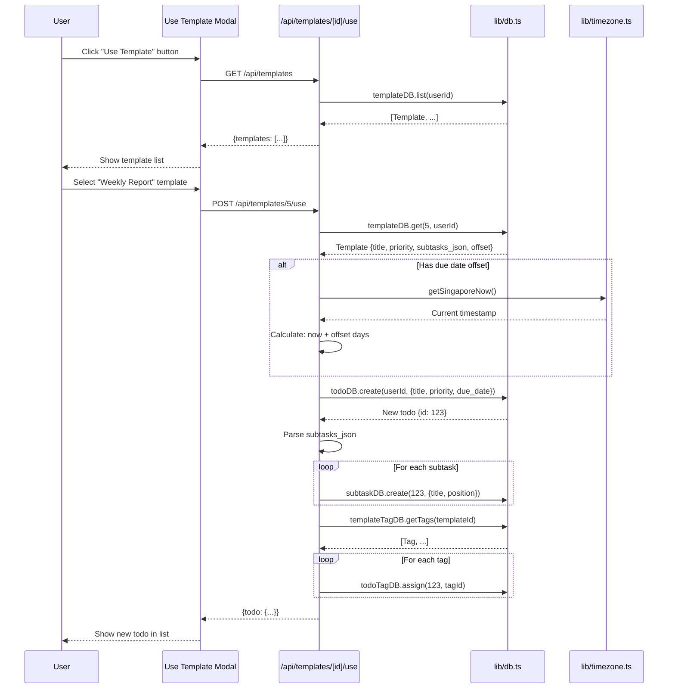

# PRP 07: Template System - Architecture & System Design

## 1. Feature Summary

**What**: Save recurring todo patterns as reusable templates with subtasks, tags, and metadata.

**Who**: Users with repetitive multi-step tasks (e.g., "Weekly Report", "Onboarding Checklist").

**Why**: Reduces manual todo creation effort, ensures consistency, and speeds up workflow.

**Scope**: Create template from existing todo, save template with subtasks/tags/priority, use template to create new todo, due date offset calculation, and template CRUD operations.

## 2. UI/UX Behavior

### Creating Template
- **Trigger**: "Save as Template" button on todo (when expanded)
- **Modal**: 
  - Template name input (required, max 50 chars)
  - Due date offset dropdown (optional): "Due in 1 day", "Due in 1 week", "Due in 1 month", etc.
  - Confirmation: "This will save the title, priority, tags, and subtasks"
- **Action**: Creates template with JSON-serialized subtasks

### Using Template
- **Trigger**: "Use Template" button in header OR dropdown in todo form
- **UI**: Modal listing all user's templates (name + preview)
- **Preview**: Show title, priority badge, tag count, subtask count
- **Action**: Click template → Creates new todo with:
  - Template title (user can edit before creating)
  - Priority from template
  - Tags from template
  - Subtasks from template (all unchecked)
  - Due date calculated from offset (if set)

### Template Management
- **List View**: "Templates" section in sidebar/modal
- **Edit**: Click template → Modify name, offset (does NOT update underlying data)
- **Delete**: Delete icon with confirmation

## 3. Data Model

### Template Interface
```typescript
interface Template {
  id: number;
  user_id: number;
  name: string;                    // Max 50 chars, unique per user
  title: string;                   // The todo title to create
  priority: Priority;              // Default priority
  subtasks_json: string;           // JSON array: [{title, position}, ...]
  due_date_offset_days: number | null;  // Days from now (1, 7, 30, etc.)
  created_at: string;
}
```

### Database Schema
```sql
CREATE TABLE templates (
  id INTEGER PRIMARY KEY AUTOINCREMENT,
  user_id INTEGER NOT NULL,
  name TEXT NOT NULL CHECK(length(name) <= 50),
  title TEXT NOT NULL,
  priority TEXT NOT NULL DEFAULT 'medium',
  subtasks_json TEXT,  -- JSON string: [{title: "...", position: 0}, ...]
  due_date_offset_days INTEGER,
  created_at TEXT NOT NULL DEFAULT (datetime('now')),
  FOREIGN KEY (user_id) REFERENCES users(id) ON DELETE CASCADE,
  UNIQUE(user_id, name)
);

CREATE INDEX idx_templates_user_id ON templates(user_id);
```

### Template-Tag Junction Table
```sql
CREATE TABLE template_tags (
  template_id INTEGER NOT NULL,
  tag_id INTEGER NOT NULL,
  PRIMARY KEY (template_id, tag_id),
  FOREIGN KEY (template_id) REFERENCES templates(id) ON DELETE CASCADE,
  FOREIGN KEY (tag_id) REFERENCES tags(id) ON DELETE CASCADE
);
```

### Subtasks JSON Format
```json
[
  {"title": "Step 1: Research", "position": 0},
  {"title": "Step 2: Draft", "position": 1},
  {"title": "Step 3: Review", "position": 2}
]
```

## 4. Component Impact Map

### New Files
- `app/api/templates/route.ts` - GET (list), POST (create)
- `app/api/templates/[id]/route.ts` - GET, PUT, DELETE
- `app/api/templates/[id]/use/route.ts` - POST (create todo from template)

### Modified Files
- `lib/db.ts`:
  - Add `Template` interface
  - Add `templateDB` CRUD methods
  - Add `templateTagDB` for junction table
- `app/page.tsx`:
  - Add "Save as Template" button on todos
  - Add "Use Template" modal
  - Add TemplateList component

## 5. State & Data Flow

### Use Template Flow


## 6. API Specification

### GET /api/templates
**Response**: `{templates: [{id, name, title, priority, subtasks_json, due_date_offset_days}, ...]}`

### POST /api/templates
**Body**:
```json
{
  "name": "Weekly Report",
  "title": "Prepare weekly report",
  "priority": "high",
  "subtasks": [{"title": "Gather data", "position": 0}, ...],
  "tag_ids": [1, 3],
  "due_date_offset_days": 7
}
```
**Response**: 201 Created

### POST /api/templates/[id]/use
**Body**: `{}` (optional: override fields)
**Response**: 200 OK `{todo: {...}}`
**Logic**:
1. Get template
2. Calculate due date (now + offset)
3. Create todo
4. Create subtasks from JSON
5. Assign tags
6. Return new todo

## 7. Component Specifications

### TemplateCard Component
```typescript
interface TemplateCardProps {
  template: Template;
  onUse: (id: number) => void;
  onEdit: (id: number) => void;
  onDelete: (id: number) => void;
}

// Displays:
// - Template name (bold)
// - Preview: priority badge, X tags, Y subtasks
// - "Use" button (primary)
// - Edit/delete icons
```

### SaveTemplateModal Component
```typescript
interface SaveTemplateModalProps {
  todo: Todo;  // Source todo to save as template
  onSave: (name: string, offset: number | null) => void;
  onCancel: () => void;
}

// Form fields:
// - Template name (required)
// - Due date offset (optional dropdown)
// - Preview of what will be saved
```

## 8. Non-Functional Requirements

### Accessibility
- ✅ **Keyboard navigation**: Tab through template list, Enter to use
- ✅ **Screen readers**: Announce template count and details

### Performance
- ✅ **JSON parsing**: < 10ms for typical templates (< 20 subtasks)
- ✅ **Batch inserts**: Use DB transaction for subtask creation

### Security & Privacy
- ✅ **JSON validation**: Validate subtasks_json format before parsing
- ✅ **User isolation**: Templates scoped to user_id

### Maintainability
- ✅ **Schema versioning**: Future-proof subtasks_json (add version field if needed)
- ✅ **Type safety**: Parse JSON with Zod or manual validation

## 9. Implementation Steps

1. **Database setup**: Create `templates` and `template_tags` tables
2. **Template CRUD APIs**: `/api/templates/*` endpoints
3. **Save template from todo**: Extract metadata, serialize subtasks to JSON
4. **Use template API**: Parse JSON, create todo + subtasks + tag assignments
5. **UI components**: TemplateCard, SaveTemplateModal, UseTemplateModal
6. **Due date offset calculation**: Add offset days to current Singapore time
7. **Testing**: E2E tests for save and use template flows

## 10. Acceptance Criteria

- ✅ User can save existing todo as template (with name and optional offset)
- ✅ Template includes: title, priority, tags, subtasks (as JSON)
- ✅ User can view list of templates
- ✅ User can use template to create new todo
- ✅ Using template creates todo with all metadata
- ✅ Using template calculates due date from offset (if set)
- ✅ User can edit/delete templates
- ✅ Template names unique per user

## 11. Out of Scope

- ❌ Template categories/folders
- ❌ Public template library (shared templates)
- ❌ Template versioning (track changes)
- ❌ Template variables (placeholders like {project_name})
- ❌ Template suggestions based on usage

---

**Version**: 1.0  
**Last Updated**: 2026-02-06  
**Status**: Ready for implementation
