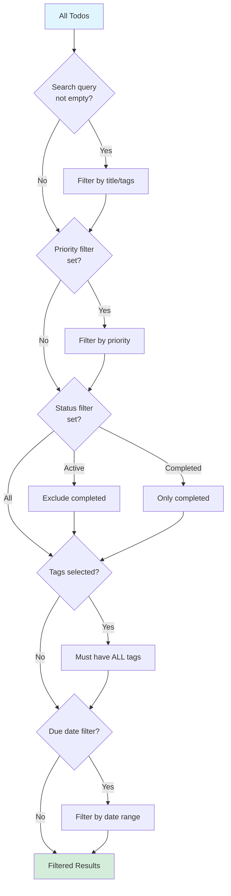

# PRP 08: Search & Filtering - Architecture & System Design

## 1. Feature Summary

**What**: Real-time text search across todo titles/tags, plus multi-criteria filtering (priority, completion status, tags, due date range).

**Who**: Users with large todo lists needing to quickly find specific tasks.

**Why**: Improves productivity by reducing cognitive load and time spent scanning lists.

**Scope**: Search input with instant results, filter controls (priority pills, status toggles, tag dropdown, date range picker), combined filters (search + filters), and client-side performance optimization.

## 2. UI/UX Behavior

### Search Bar
- **Position**: Top of todo list, always visible
- **Placeholder**: "Search todos and tags..."
- **Behavior**: 
  - Live search (updates as user types)
  - Debounced (300ms delay to reduce re-renders)
  - Clear button (× icon) when text entered
- **Matching**: Case-insensitive, partial match on todo title and tag names

### Filter Controls
- **Priority Filter**: Three pill buttons (All, High, Medium, Low) - same as PRP 02
- **Status Filter**: Toggle buttons (All, Active, Completed)
- **Tag Filter**: Multi-select dropdown (show only todos with ALL selected tags)
- **Due Date Filter**: Date range picker (From/To) with presets:
  - Today
  - This Week
  - This Month
  - Overdue
  - No Due Date

### Combined Filters
- **Logic**: AND operation (all filters must match)
- **Example**: Search "meeting" + Priority: High + Status: Active → Shows only active high-priority todos with "meeting" in title/tags
- **Clear All**: Button to reset all filters

### Empty State
- **No results**: "No todos found matching your filters. Try adjusting your search."
- **Show filter summary**: "Showing 0 of 25 todos (filtered by: search, priority, tags)"

## 3. Data Model

### Filter State Interface
```typescript
interface FilterState {
  searchQuery: string;                // Search text
  priority: Priority | 'all';         // Priority filter
  status: 'all' | 'active' | 'completed';
  tags: number[];                     // Array of tag IDs (AND logic)
  dueDateRange: {
    from: string | null;              // ISO date
    to: string | null;
  } | null;
  showOverdue: boolean;
  showNoDueDate: boolean;
}
```

### No Database Changes
All filtering performed **client-side** on already-fetched todos.

## 4. Component Impact Map

### Modified Files
- `app/page.tsx`:
  - Add SearchBar component
  - Add FilterControls component
  - Add `useFilteredTodos` hook (memoized filtering logic)
  - Add filter state management (useState)

### New Components
```
SearchBar
├── Props: { value, onChange, onClear }
└── Debounced input

FilterControls
├── PriorityFilter (reuse from PRP 02)
├── StatusFilter
├── TagFilter
├── DueDateFilter
└── ClearAllButton

FilterSummary
└── Shows active filter count
```

## 5. State & Data Flow

### Filtering Logic


### Filtering Implementation
```typescript
const useFilteredTodos = (todos: Todo[], filters: FilterState) => {
  return useMemo(() => {
    let result = todos;
    
    // Search filter
    if (filters.searchQuery) {
      const query = filters.searchQuery.toLowerCase();
      result = result.filter(todo => 
        todo.title.toLowerCase().includes(query) ||
        todo.tags?.some(tag => tag.name.toLowerCase().includes(query))
      );
    }
    
    // Priority filter
    if (filters.priority !== 'all') {
      result = result.filter(todo => todo.priority === filters.priority);
    }
    
    // Status filter
    if (filters.status === 'active') {
      result = result.filter(todo => !todo.completed);
    } else if (filters.status === 'completed') {
      result = result.filter(todo => todo.completed);
    }
    
    // Tag filter (AND logic: must have ALL selected tags)
    if (filters.tags.length > 0) {
      result = result.filter(todo => 
        filters.tags.every(tagId => 
          todo.tags?.some(tag => tag.id === tagId)
        )
      );
    }
    
    // Due date range filter
    if (filters.dueDateRange) {
      result = result.filter(todo => {
        if (!todo.due_date) return filters.showNoDueDate;
        const dueDate = new Date(todo.due_date);
        const from = filters.dueDateRange.from ? new Date(filters.dueDateRange.from) : null;
        const to = filters.dueDateRange.to ? new Date(filters.dueDateRange.to) : null;
        
        if (from && dueDate < from) return false;
        if (to && dueDate > to) return false;
        return true;
      });
    }
    
    // Overdue filter
    if (filters.showOverdue) {
      const now = getSingaporeNow();
      result = result.filter(todo => 
        todo.due_date && new Date(todo.due_date) < now && !todo.completed
      );
    }
    
    return result;
  }, [todos, filters]);
};
```

## 6. Component Specifications

### SearchBar Component
```typescript
interface SearchBarProps {
  value: string;
  onChange: (value: string) => void;
  onClear: () => void;
}

// Features:
// - Debounced input (useDebounce hook, 300ms)
// - Clear button (× icon)
// - Search icon (🔍)
// - Auto-focus on "/" keyboard shortcut
```

### FilterControls Component
```typescript
interface FilterControlsProps {
  filters: FilterState;
  onChange: (filters: Partial<FilterState>) => void;
  onClearAll: () => void;
  availableTags: Tag[];
}

// Layout:
// - Row 1: Search bar (full width)
// - Row 2: Priority pills + Status toggles
// - Row 3: Tag multi-select + Due date range
// - Row 4: "Clear all filters" link (if any active)
```

### FilterSummary Component
```typescript
interface FilterSummaryProps {
  totalCount: number;
  filteredCount: number;
  activeFilters: string[];  // ["search", "priority: high", "tags: work, urgent"]
}

// Displays:
// "Showing 5 of 25 todos (filtered by: search, priority, tags)"
```

## 7. Non-Functional Requirements

### Accessibility
- ✅ **Keyboard shortcuts**: "/" to focus search, Escape to clear
- ✅ **Screen reader**: Announce result count on filter change
- ✅ **Focus management**: Preserve focus when filters update

### Performance
- ✅ **Debounced search**: 300ms delay (reduce re-renders while typing)
- ✅ **Memoization**: `useMemo` for filtered results (only recompute when deps change)
- ✅ **< 100 todos**: O(n) filtering is acceptable (< 10ms)
- ✅ **> 100 todos**: Consider virtualized list (future optimization)

### Security & Privacy
- ✅ **Client-side only**: No sensitive data sent to server for filtering
- ✅ **XSS prevention**: React auto-escapes search query display

### Maintainability
- ✅ **Single source**: FilterState interface centralized
- ✅ **Composable filters**: Each filter independent, easy to add/remove
- ✅ **URL state**: Future enhancement (persist filters in URL query params)

## 8. Implementation Steps

1. **Add filter state** (app/page.tsx):
   - `useState<FilterState>` for all filter values
   - Initialize with defaults (all filters off)

2. **Create useDebounce hook**:
   - Generic hook for debouncing any value
   - 300ms delay for search query

3. **Implement useFilteredTodos hook**:
   - Use `useMemo` to recompute only when todos or filters change
   - Apply filters in sequence (search → priority → status → tags → dates)

4. **Create SearchBar component**:
   - Controlled input with debounced onChange
   - Clear button
   - Keyboard shortcut (/)

5. **Create FilterControls component**:
   - Reuse PriorityFilter from PRP 02
   - Add StatusFilter toggle buttons
   - Add TagFilter multi-select
   - Add DueDateFilter range picker

6. **Add FilterSummary**:
   - Display "X of Y todos" count
   - List active filters as badges

7. **Integrate with todo list**:
   - Replace `todos` with `filteredTodos` in rendering
   - Show empty state when filtered results empty

8. **Testing**:
   - E2E test: Search by title
   - Test: Search by tag name
   - Test: Combined filters (search + priority + tags)
   - Test: Debouncing (search doesn't trigger until typing stops)

## 9. Edge Cases

### Empty Search Query
- **Behavior**: Show all todos (no filtering)
- **Clear button**: Hidden when input empty

### No Results
- **Display**: Empty state message
- **Suggestion**: "Try adjusting your filters" or "Clear all filters"

### Special Characters in Search
- **Handling**: Escape regex special chars (if using regex)
- **Case sensitivity**: Always case-insensitive

### Filter Combinations
- **Search + Priority + Tags**: AND logic (all must match)
- **Multiple tags**: AND logic (todo must have ALL selected tags)

### Performance with Many Todos
- **Threshold**: > 200 todos may lag (O(n) filtering)
- **Mitigation**: 
  - Virtual scrolling (future)
  - Server-side filtering (future)
  - IndexedDB caching (future)

## 10. Acceptance Criteria

- ✅ User can search by todo title (case-insensitive, partial match)
- ✅ User can search by tag name
- ✅ Search is debounced (300ms delay)
- ✅ User can filter by priority (High/Medium/Low)
- ✅ User can filter by status (All/Active/Completed)
- ✅ User can filter by multiple tags (AND logic)
- ✅ User can filter by due date range
- ✅ User can filter by "Overdue" preset
- ✅ Filters combine with AND logic (all must match)
- ✅ User can clear all filters with one click
- ✅ Filter summary shows result count and active filters
- ✅ Empty state displayed when no results

## 11. Out of Scope

- ❌ Advanced search syntax (quotes, operators)
- ❌ Full-text search (stemming, fuzzy matching)
- ❌ Search history/suggestions
- ❌ Saved filter presets
- ❌ Server-side filtering (for scalability)
- ❌ URL state persistence
- ❌ Tag OR logic (show todos with ANY selected tag)

---

**Version**: 1.0  
**Last Updated**: 2026-02-06  
**Status**: Ready for implementation
