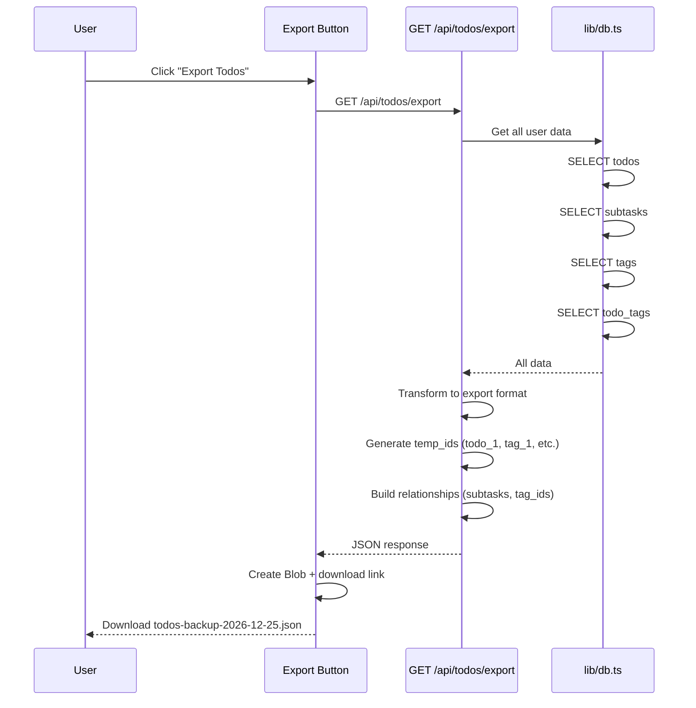
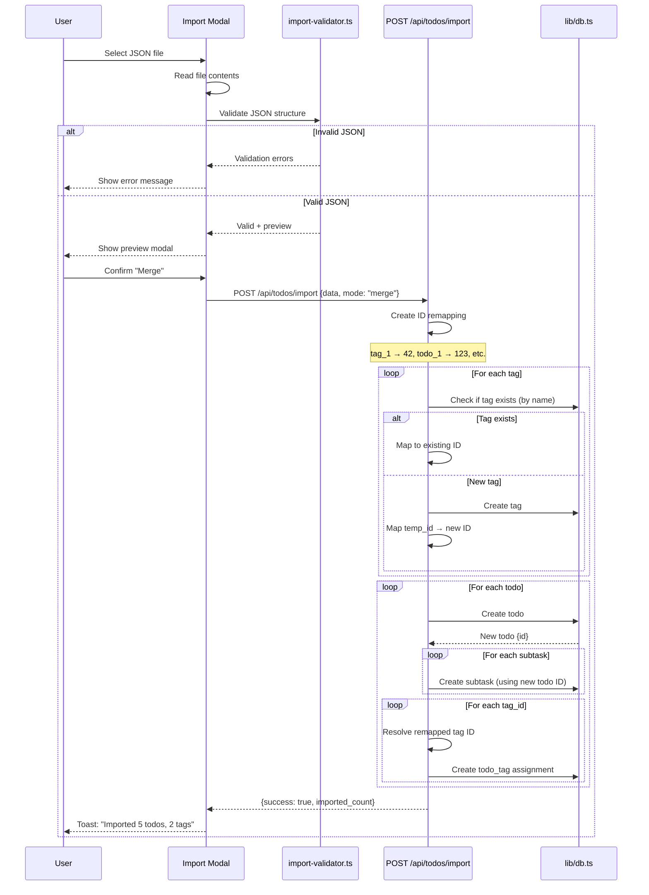

# PRP 09: Export & Import - Architecture & System Design

## 1. Feature Summary

**What**: JSON-based backup and restore system for todos, subtasks, and tags with relationship preservation.

**Who**: Users backing up data, migrating between devices, or sharing todo lists.

**Why**: Data portability, backup safety, and enables offline editing scenarios.

**Scope**: Export all user data as JSON file, import JSON with validation, ID remapping on import, relationship preservation (todos ↔ tags, todos ↔ subtasks), and duplicate handling.

## 2. UI/UX Behavior

### Export
- **Trigger**: "Export Todos" button in header/settings
- **Action**: 
  1. Fetch all user data (todos, subtasks, tags, tag assignments)
  2. Generate JSON file
  3. Download as `todos-backup-YYYY-MM-DD.json`
- **Progress**: Show loading spinner during export (< 1s for typical data)

### Import
- **Trigger**: "Import Todos" button
- **File Picker**: Accept only `.json` files
- **Validation Modal**: 
  - Show preview: "X todos, Y tags, Z subtasks"
  - Options:
    - "Replace all data" (delete existing, import new)
    - "Merge" (add to existing, skip duplicates)
  - Confirm button
- **Progress**: Show progress bar during import
- **Success**: "Imported X todos, Y tags successfully" toast
- **Errors**: 
  - "Invalid JSON format"
  - "Missing required fields"
  - Show detailed validation errors

## 3. Data Model

### Export JSON Structure
```typescript
interface ExportData {
  version: string;              // Schema version (e.g., "1.0")
  exported_at: string;          // ISO timestamp
  user: {
    username: string;           // For reference only
  };
  todos: ExportTodo[];
  tags: ExportTag[];
}

interface ExportTodo {
  // Original ID preserved for reference (but remapped on import)
  temp_id: string;              // e.g., "todo_1"
  title: string;
  completed: boolean;
  priority: Priority;
  due_date: string | null;
  recurrence_pattern: RecurrencePattern | null;
  reminder_minutes: number | null;
  created_at: string;
  subtasks: ExportSubtask[];
  tag_ids: string[];            // Array of temp_id refs (e.g., ["tag_1", "tag_2"])
}

interface ExportSubtask {
  temp_id: string;
  title: string;
  completed: boolean;
  position: number;
}

interface ExportTag {
  temp_id: string;
  name: string;
  color: string;
}
```

### Example Export JSON
```json
{
  "version": "1.0",
  "exported_at": "2026-12-25T10:00:00+08:00",
  "user": {
    "username": "alice"
  },
  "todos": [
    {
      "temp_id": "todo_1",
      "title": "Team meeting",
      "completed": false,
      "priority": "high",
      "due_date": "2026-12-26T14:00:00+08:00",
      "recurrence_pattern": "weekly",
      "reminder_minutes": 60,
      "created_at": "2026-12-20T09:00:00+08:00",
      "subtasks": [
        {"temp_id": "sub_1", "title": "Prepare agenda", "completed": true, "position": 0},
        {"temp_id": "sub_2", "title": "Book room", "completed": false, "position": 1}
      ],
      "tag_ids": ["tag_1", "tag_2"]
    }
  ],
  "tags": [
    {"temp_id": "tag_1", "name": "work", "color": "#3B82F6"},
    {"temp_id": "tag_2", "name": "urgent", "color": "#EF4444"}
  ]
}
```

## 4. Component Impact Map

### New Files
- `app/api/todos/export/route.ts` - GET (export all data as JSON)
- `app/api/todos/import/route.ts` - POST (import JSON data)
- `lib/import-validator.ts` - Validation logic for import JSON

### Modified Files
- `app/page.tsx`:
  - Add "Export" button (triggers download)
  - Add "Import" button (file picker + confirmation modal)

## 5. State & Data Flow

### Export Flow


### Import Flow


## 6. API Specification

### GET /api/todos/export
**Auth**: Required
**Response**: 200 OK (application/json)
```json
{
  "version": "1.0",
  "exported_at": "...",
  "user": {...},
  "todos": [...],
  "tags": [...]
}
```

**Headers**:
- `Content-Type: application/json`
- `Content-Disposition: attachment; filename="todos-backup-2026-12-25.json"`

### POST /api/todos/import
**Auth**: Required
**Body**:
```json
{
  "data": {...},          // ExportData object
  "mode": "merge" | "replace"
}
```

**Response**: 200 OK
```json
{
  "success": true,
  "imported": {
    "todos": 5,
    "tags": 2,
    "subtasks": 10
  }
}
```

**Errors**:
- 400 Bad Request: `{"error": "Invalid JSON structure", "details": [...]}`
- 422 Unprocessable Entity: `{"error": "Missing required field: todos"}`

## 7. ID Remapping Logic

### Strategy
1. **Tags**: Match by name first (avoid duplicates), create new if not exists
2. **Todos**: Always create new (even if title matches)
3. **Subtasks**: Create new with remapped todo_id
4. **Tag assignments**: Use remapped tag_ids and todo_ids

### Remapping Table
```typescript
const idMap = {
  tags: new Map<string, number>(),    // temp_id → real_id
  todos: new Map<string, number>(),
  subtasks: new Map<string, number>(),
};

// Example:
// idMap.tags.set('tag_1', 42);
// idMap.todos.set('todo_1', 123);
```

## 8. Non-Functional Requirements

### Accessibility
- ✅ **Keyboard**: Tab to buttons, Enter to trigger
- ✅ **Screen reader**: Announce progress during import

### Performance
- ✅ **Export**: < 1s for 100 todos (simple JSON serialization)
- ✅ **Import**: < 5s for 100 todos (DB inserts with transaction)
- ✅ **Large files**: Show progress bar for > 50 todos

### Security & Privacy
- ✅ **Validation**: Strict schema validation before import
- ✅ **Sanitization**: Escape/validate all string fields
- ✅ **User isolation**: Imported data scoped to session.userId
- ✅ **No executable code**: JSON only (no eval)

### Maintainability
- ✅ **Schema versioning**: `version` field allows future migrations
- ✅ **Backward compatibility**: Handle old export versions gracefully
- ✅ **Validation layer**: Centralized in `import-validator.ts`

## 9. Implementation Steps

1. **Export API**:
   - Query all user data (todos, subtasks, tags, todo_tags)
   - Transform to export format with temp_ids
   - Return JSON with correct headers (attachment)

2. **Import validator**:
   - Check required fields (version, todos, tags)
   - Validate data types (title is string, completed is boolean, etc.)
   - Validate relationships (tag_ids reference valid tags)
   - Return detailed errors or success

3. **Import API**:
   - Validate incoming JSON
   - Create ID remapping tables
   - Import tags first (match by name or create new)
   - Import todos with remapped tag_ids
   - Import subtasks with remapped todo_ids
   - Use DB transaction for atomicity

4. **UI components**:
   - Export button → triggers download
   - Import button → file picker → validation → confirmation modal
   - Show progress/errors

5. **Testing**:
   - E2E test: Export → Import → Verify data integrity
   - Test: Tag deduplication (merge mode)
   - Test: Replace mode (delete all, import new)
   - Test: Invalid JSON handling

## 10. Acceptance Criteria

- ✅ User can export all todos to JSON file
- ✅ Export includes todos, subtasks, tags, and relationships
- ✅ User can import JSON file (merge or replace mode)
- ✅ Import validates JSON structure before processing
- ✅ Import remaps IDs correctly (preserves relationships)
- ✅ Import handles tag duplicates (merge mode: reuse existing)
- ✅ Import preserves due dates (Singapore timezone)
- ✅ Import shows progress for large files
- ✅ Import shows detailed errors if validation fails
- ✅ Exported data can be re-imported without errors

## 11. Out of Scope

- ❌ Incremental export (export only changes since last export)
- ❌ Encrypted exports (password-protected backups)
- ❌ Cloud sync (auto-backup to Google Drive, Dropbox)
- ❌ CSV export (alternative format)
- ❌ Import from other apps (Todoist, Asana, etc.)
- ❌ Conflict resolution (if importing duplicate todos)
- ❌ Undo import

---

**Version**: 1.0  
**Last Updated**: 2026-02-06  
**Status**: Ready for implementation
