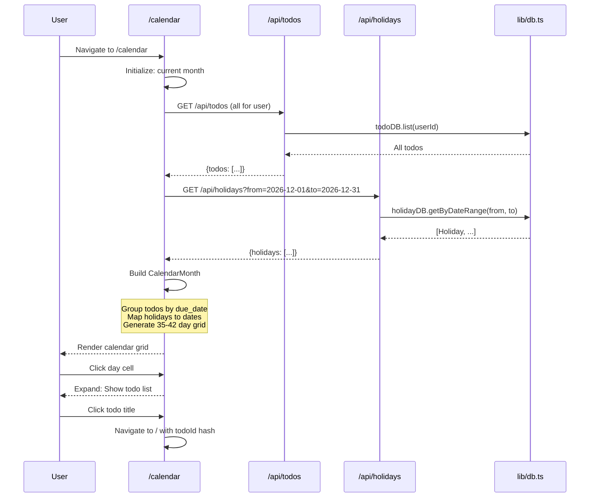

# PRP 10: Calendar View - Architecture & System Design

## 1. Feature Summary

**What**: Monthly calendar visualization showing todos on their due dates, integrated with Singapore public holidays.

**Who**: Users planning tasks with date-based context.

**Why**: Provides temporal overview, helps identify busy periods, and shows holidays for better planning.

**Scope**: Monthly grid calendar, todo display on due date cells, Singapore holiday highlighting, month navigation (prev/next), today indicator, and click-to-view todo details.

## 2. UI/UX Behavior

### Calendar Layout
- **Route**: `/calendar` (separate page from main todo list)
- **Header**: Month/Year title with ← → navigation arrows
- **Grid**: 7 columns (Sun-Sat) × 5-6 rows (weeks)
- **Cell Content**:
  - Day number (e.g., "25")
  - Holiday name (if holiday, in red/green)
  - Todo count badge (e.g., "3 tasks")
  - Click to expand: Show todo titles (truncated)

### Today Indicator
- **Visual**: Blue border or background highlight on current date
- **Auto-scroll**: Calendar opens to current month

### Holiday Display
- **Singapore Holidays**: 
  - Cell has red/green background tint
  - Holiday name displayed (e.g., "Christmas Day")
  - Fetched from `holidays` table (pre-seeded)

### Todo Display in Cells
- **Collapsed**: Show count badge "3 tasks" (color-coded by priority)
- **Expanded (on click)**: 
  - List of todo titles (max 3 visible, "...and 2 more")
  - Priority badges next to titles
  - Click todo title → Navigate to `/` and scroll to todo

### Month Navigation
- **Previous/Next buttons**: ← December 2026 / January 2027 →
- **Month/Year picker**: Click to open date picker (jump to any month)

### Empty States
- **No todos this month**: Show calendar grid, no badges
- **No holidays this month**: Show normal grid

## 3. Data Model

### Holiday Interface
```typescript
interface Holiday {
  id: number;
  date: string;              // ISO date (YYYY-MM-DD)
  name: string;              // "Christmas Day"
  type: 'public' | 'observance';
  created_at: string;
}
```

### Database Schema (Holidays)
```sql
CREATE TABLE holidays (
  id INTEGER PRIMARY KEY AUTOINCREMENT,
  date TEXT NOT NULL UNIQUE,
  name TEXT NOT NULL,
  type TEXT NOT NULL DEFAULT 'public' CHECK(type IN ('public', 'observance')),
  created_at TEXT NOT NULL DEFAULT (datetime('now'))
);

CREATE INDEX idx_holidays_date ON holidays(date);
```

### Calendar Data Structure
```typescript
interface CalendarDay {
  date: string;              // YYYY-MM-DD
  isToday: boolean;
  isCurrentMonth: boolean;   // False for padding days from prev/next month
  holiday: Holiday | null;
  todos: Todo[];             // Todos with due_date matching this date
}

interface CalendarMonth {
  year: number;
  month: number;             // 1-12
  days: CalendarDay[];       // 35-42 days (5-6 weeks)
}
```

## 4. Component Impact Map

### New Files
- `app/calendar/page.tsx` - Calendar view component
- `app/api/holidays/route.ts` - GET holidays for date range
- `scripts/seed-holidays.ts` - Pre-seed Singapore holidays (2024-2030)

### Modified Files
- `lib/db.ts`:
  - Add `Holiday` interface
  - Add `holidayDB.getByDateRange(from, to)` method
- `middleware.ts`:
  - Protect `/calendar` route (require auth)

## 5. State & Data Flow

### Data Flow Diagram


### Calendar Grid Generation
```typescript
function generateCalendarMonth(year: number, month: number, todos: Todo[], holidays: Holiday[]): CalendarMonth {
  const firstDay = new Date(year, month - 1, 1);
  const lastDay = new Date(year, month, 0);
  const startPadding = firstDay.getDay(); // 0=Sun, 6=Sat
  const totalDays = lastDay.getDate();
  const days: CalendarDay[] = [];
  
  // Padding days from previous month
  const prevMonthLastDay = new Date(year, month - 1, 0).getDate();
  for (let i = startPadding - 1; i >= 0; i--) {
    days.push({
      date: formatDate(new Date(year, month - 2, prevMonthLastDay - i)),
      isToday: false,
      isCurrentMonth: false,
      holiday: null,
      todos: [],
    });
  }
  
  // Current month days
  for (let day = 1; day <= totalDays; day++) {
    const date = formatDate(new Date(year, month - 1, day));
    days.push({
      date,
      isToday: date === formatDate(getSingaporeNow()),
      isCurrentMonth: true,
      holiday: holidays.find(h => h.date === date) || null,
      todos: todos.filter(t => t.due_date?.startsWith(date)),
    });
  }
  
  // Padding days from next month
  const remainingCells = Math.ceil(days.length / 7) * 7 - days.length;
  for (let i = 1; i <= remainingCells; i++) {
    days.push({
      date: formatDate(new Date(year, month, i)),
      isToday: false,
      isCurrentMonth: false,
      holiday: null,
      todos: [],
    });
  }
  
  return { year, month, days };
}
```

## 6. API Specification

### GET /api/holidays
**Query Params**:
- `from` (required): ISO date (YYYY-MM-DD)
- `to` (required): ISO date (YYYY-MM-DD)

**Response**: 200 OK
```json
{
  "holidays": [
    {"id": 1, "date": "2026-12-25", "name": "Christmas Day", "type": "public"},
    {"id": 2, "date": "2026-12-31", "name": "New Year's Eve", "type": "observance"}
  ]
}
```

### Seeding Script
**File**: `scripts/seed-holidays.ts`
```typescript
// Pre-populate Singapore holidays 2024-2030
const singaporeHolidays = [
  { date: '2026-01-01', name: "New Year's Day", type: 'public' },
  { date: '2026-02-10', name: 'Chinese New Year', type: 'public' },
  { date: '2026-02-11', name: 'Chinese New Year', type: 'public' },
  { date: '2026-04-10', name: 'Good Friday', type: 'public' },
  { date: '2026-05-01', name: 'Labour Day', type: 'public' },
  { date: '2026-05-15', name: 'Vesak Day', type: 'public' },
  { date: '2026-06-15', name: 'Hari Raya Puasa', type: 'public' },
  { date: '2026-08-09', name: 'National Day', type: 'public' },
  { date: '2026-08-21', name: 'Hari Raya Haji', type: 'public' },
  { date: '2026-10-24', name: 'Deepavali', type: 'public' },
  { date: '2026-12-25', name: 'Christmas Day', type: 'public' },
  // ... repeat for 2027-2030
];

db.prepare(`INSERT INTO holidays (date, name, type) VALUES (?, ?, ?)`).run(...);
```

## 7. Component Specifications

### CalendarGrid Component
```typescript
interface CalendarGridProps {
  month: CalendarMonth;
  onDayClick: (day: CalendarDay) => void;
  onTodoClick: (todo: Todo) => void;
}

// Renders 7×6 grid with CalendarDay cells
```

### CalendarDay Component
```typescript
interface CalendarDayProps {
  day: CalendarDay;
  onClick: () => void;
}

// Renders:
// - Day number (grayed if not current month)
// - Holiday name (if exists, red background)
// - Todo count badge (color-coded by highest priority)
// - Expanded: List of todo titles (onClick)
```

### MonthNavigator Component
```typescript
interface MonthNavigatorProps {
  year: number;
  month: number;
  onPrev: () => void;
  onNext: () => void;
  onJumpTo: (year: number, month: number) => void;
}

// Renders:
// ← December 2026 →
// (Click month/year to open picker)
```

## 8. Non-Functional Requirements

### Accessibility
- ✅ **Keyboard navigation**: Arrow keys to move between days, Enter to expand
- ✅ **Screen reader**: Announce day, holiday, todo count
- ✅ **Focus indicators**: Visible outline on focused cell
- ✅ **Semantic HTML**: `<table>` with proper `<th>` headers (Sun, Mon, ...)

### Performance
- ✅ **Initial load**: < 500ms (fetch todos + holidays)
- ✅ **Month navigation**: < 100ms (client-side re-render)
- ✅ **Virtualization**: Not needed (max 42 cells visible)

### Security & Privacy
- ✅ **Route protection**: Middleware redirects to `/login` if no session
- ✅ **User isolation**: Todos filtered by session.userId

### Maintainability
- ✅ **Timezone consistency**: All dates in Singapore timezone
- ✅ **Holiday seeding**: Script to update holidays annually
- ✅ **Reusable logic**: `generateCalendarMonth` helper function

## 9. Implementation Steps

1. **Database setup**:
   - Create `holidays` table
   - Seed Singapore holidays (2024-2030) via script

2. **Holiday API**:
   - Implement `GET /api/holidays?from=X&to=Y`
   - Query holidays by date range

3. **Calendar page** (`app/calendar/page.tsx`):
   - Fetch todos and holidays on mount
   - Implement `generateCalendarMonth` logic
   - Render MonthNavigator + CalendarGrid

4. **CalendarGrid component**:
   - 7-column table (Sun-Sat headers)
   - Map over days to render CalendarDay cells
   - Handle day click (expand/collapse)

5. **CalendarDay component**:
   - Display day number
   - Show holiday name (if exists)
   - Show todo count badge
   - Expand to show todo list (on click)

6. **Month navigation**:
   - Prev/Next buttons (update month state)
   - Month/Year picker (optional, for MVP use buttons only)

7. **Styling**:
   - Today: Blue border or background
   - Holiday: Red/green background tint
   - Weekend: Light gray background (optional)
   - Padding days: Grayed out text

8. **Testing**:
   - E2E test: Navigate to calendar, verify current month displays
   - Test: Click day cell, verify todos shown
   - Test: Navigate to prev/next month
   - Test: Holidays display correctly

## 10. Edge Cases

### Month with 6 Weeks
- **Example**: February 2026 starts on Sunday → Needs 6 weeks (42 cells)
- **Handling**: Dynamic grid height based on week count

### No Todos This Month
- **Display**: Empty calendar grid (no badges)
- **UX**: Not an error state (just empty)

### Multiple Holidays on Same Date
- **Singapore**: Rare, but possible (e.g., substitute holidays)
- **Display**: Show both holiday names (comma-separated)

### Todos Without Due Date
- **Handling**: Do NOT show on calendar (only dated todos)

### Overdue Todos
- **Visual**: Optional red badge or exclamation mark on past dates

## 11. Acceptance Criteria

- ✅ User can navigate to `/calendar` page (protected route)
- ✅ Calendar displays current month on load
- ✅ Calendar shows 7-column grid (Sun-Sat)
- ✅ Today's date highlighted with blue border
- ✅ Singapore holidays displayed with name and color
- ✅ Todos shown on their due date cells (count badge)
- ✅ Click day cell to expand and see todo list
- ✅ Click todo title to navigate to main list (scroll to todo)
- ✅ User can navigate to prev/next month
- ✅ Padding days from prev/next month shown in gray

## 12. Out of Scope

- ❌ Week view, day view (only month view)
- ❌ Drag-and-drop to reschedule todos
- ❌ Create todo directly from calendar (future enhancement)
- ❌ Multi-day events (todos are single-day only)
- ❌ Custom holiday addition (use pre-seeded only)
- ❌ iCal/Google Calendar integration
- ❌ Print calendar

---

**Version**: 1.0  
**Last Updated**: 2026-02-06  
**Status**: Ready for implementation
