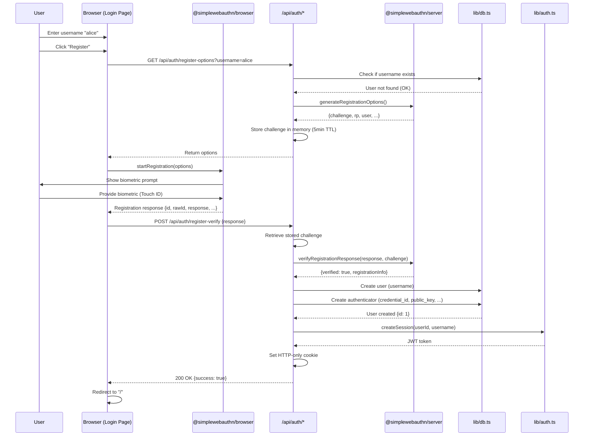
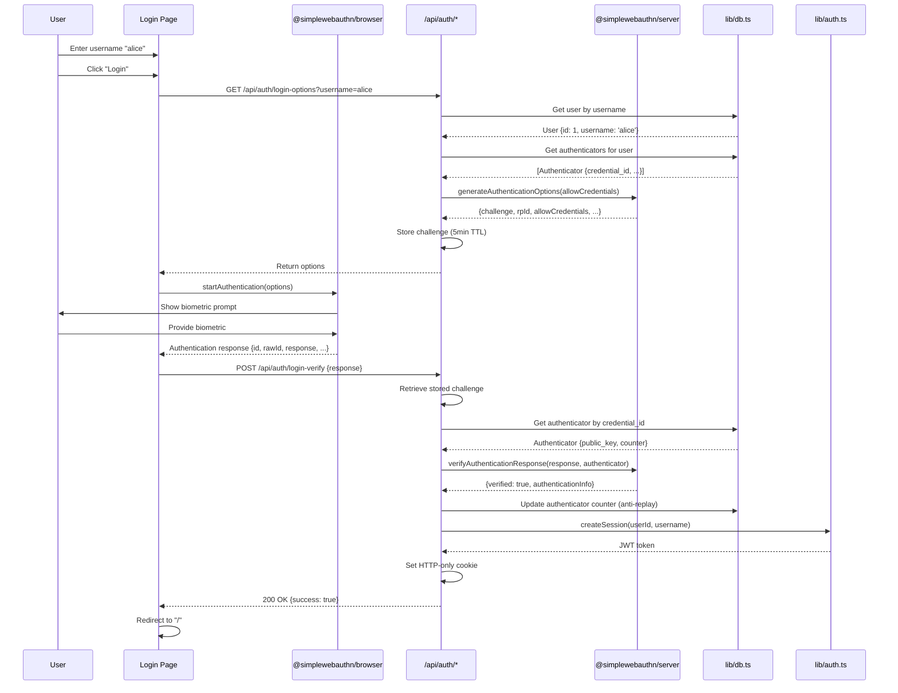
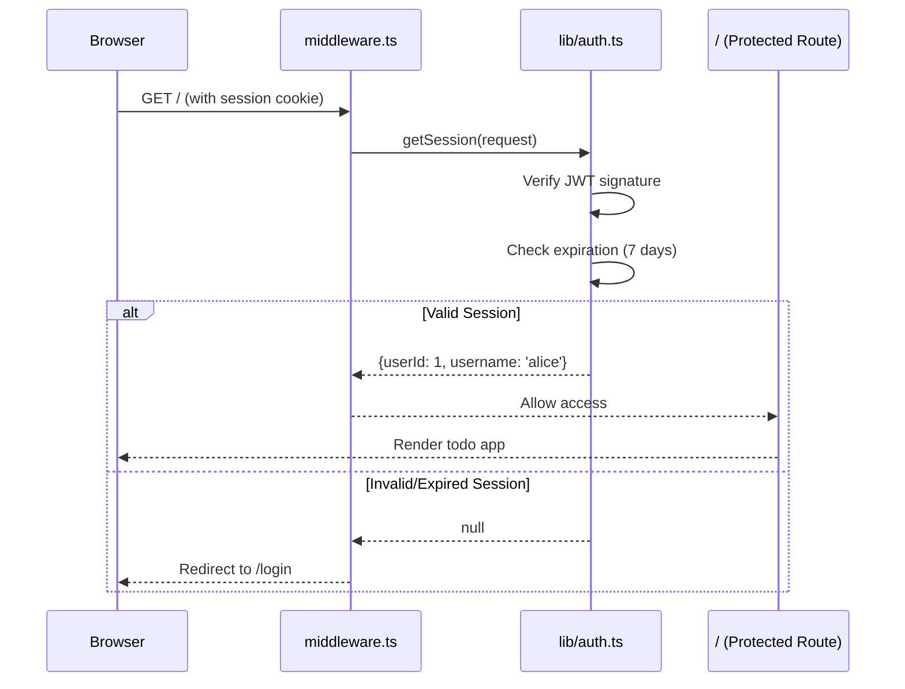
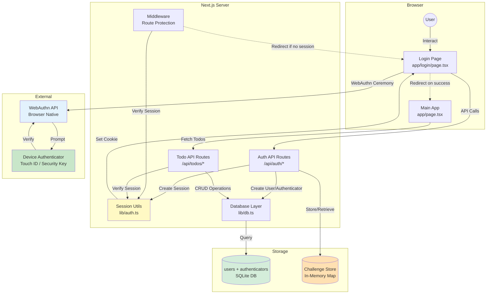
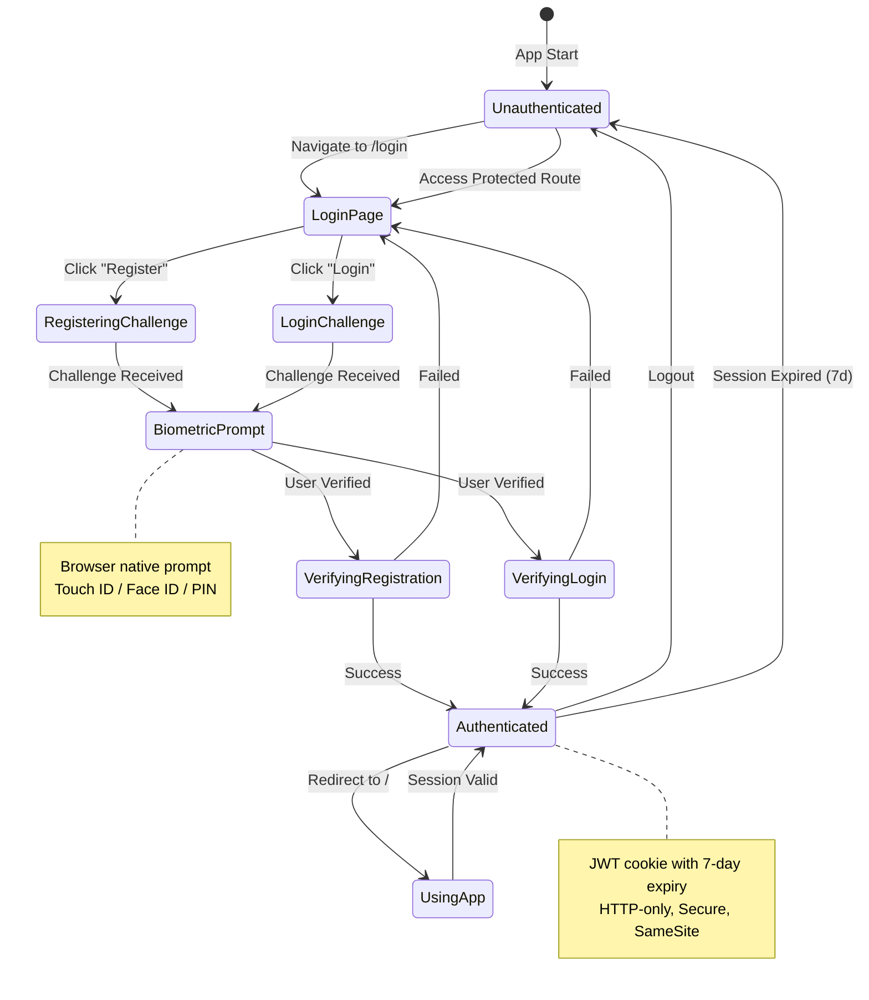

# PRP 11: WebAuthn/Passkeys Authentication - Architecture & System Design

## 1. Feature Summary

**What**: Passwordless authentication using WebAuthn (biometrics, security keys, or device PIN) with JWT session management.

**Who**: All users accessing the todo application (registration and login flows).

**Why**: Modern, secure authentication without password management burden. Leverages built-in device authenticators (Touch ID, Face ID, Windows Hello, etc.).

**Scope**: User registration with passkey creation, login with passkey verification, session management via HTTP-only cookies, and route protection middleware.

## 2. UI/UX Behavior

### Login Page (`/login`)
- **Initial State**: Username input field + two buttons
  - "Register" button (primary, blue)
  - "Login" button (secondary, outlined)
- **Registration Flow**:
  1. User enters username (3-30 chars, alphanumeric + underscore)
  2. Clicks "Register"
  3. Browser prompts for biometric/PIN (WebAuthn ceremony)
  4. Success → Redirect to main app (`/`)
  5. Error → Show error message below buttons
- **Login Flow**:
  1. User enters username
  2. Clicks "Login"
  3. Browser prompts for biometric/PIN verification
  4. Success → Redirect to `/`
  5. Error → "Invalid credentials or user not found"

### Main App (Protected Routes)
- **Middleware Protection**: `/` and `/calendar` routes require session
- **No Session**: Auto-redirect to `/login`
- **Session Present**: Show main app with logout button

### Logout
- **UI**: Logout button in header/nav bar
- **Behavior**: Clears session cookie → Redirects to `/login`

### Error States
- **WebAuthn not supported**: "Your browser doesn't support passkeys. Please use Chrome, Safari, or Edge."
- **User already exists**: "Username already taken. Please choose another."
- **User not found**: "No account found with that username."
- **Verification failed**: "Authentication failed. Please try again."
- **Network error**: "Connection error. Please check your internet and try again."

## 3. Data Model

### User Interface
```typescript
interface User {
  id: number;                    // Auto-increment primary key
  username: string;              // Unique, 3-30 chars
  created_at: string;            // ISO 8601 timestamp
}
```

### Authenticator Interface
```typescript
interface Authenticator {
  id: number;                              // Auto-increment primary key
  user_id: number;                         // Foreign key to users
  credential_id: string;                   // Base64URL-encoded, unique
  credential_public_key: string;           // Base64-encoded public key
  counter: number;                         // Signature counter (anti-cloning)
  credential_device_type: 'singleDevice' | 'multiDevice';
  credential_backed_up: boolean;           // Synced to cloud?
  transports: string;                      // JSON array: ['internal', 'usb', 'nfc', 'ble']
  created_at: string;
}
```

### Session Interface
```typescript
interface Session {
  userId: number;
  username: string;
  // Encoded in JWT, stored in HTTP-only cookie
}
```

### Challenge Storage (In-Memory)
```typescript
// Temporary storage for WebAuthn challenges (5-minute expiry)
const challengeStore = new Map<string, { challenge: string; expiresAt: number }>();
```

### Database Schema
```sql
CREATE TABLE users (
  id INTEGER PRIMARY KEY AUTOINCREMENT,
  username TEXT NOT NULL UNIQUE CHECK(length(username) >= 3 AND length(username) <= 30),
  created_at TEXT NOT NULL DEFAULT (datetime('now'))
);

CREATE TABLE authenticators (
  id INTEGER PRIMARY KEY AUTOINCREMENT,
  user_id INTEGER NOT NULL,
  credential_id TEXT NOT NULL UNIQUE,
  credential_public_key TEXT NOT NULL,
  counter INTEGER NOT NULL DEFAULT 0,
  credential_device_type TEXT NOT NULL CHECK(credential_device_type IN ('singleDevice', 'multiDevice')),
  credential_backed_up INTEGER NOT NULL DEFAULT 0,
  transports TEXT,  -- JSON array as string
  created_at TEXT NOT NULL DEFAULT (datetime('now')),
  FOREIGN KEY (user_id) REFERENCES users(id) ON DELETE CASCADE
);

CREATE INDEX idx_authenticators_user_id ON authenticators(user_id);
CREATE INDEX idx_authenticators_credential_id ON authenticators(credential_id);
```

## 4. Component Impact Map

### New Files
- `app/login/page.tsx` - Login/register UI (client component)
- `app/api/auth/register-options/route.ts` - Generate registration challenge
- `app/api/auth/register-verify/route.ts` - Verify registration response
- `app/api/auth/login-options/route.ts` - Generate authentication challenge
- `app/api/auth/login-verify/route.ts` - Verify authentication response
- `app/api/auth/logout/route.ts` - Clear session cookie
- `lib/auth.ts` - JWT session management utilities
- `middleware.ts` - Route protection (Next.js middleware)

### Modified Files
- `lib/db.ts` - Add `users` and `authenticators` tables, CRUD methods
- `app/layout.tsx` - Add logout button (conditionally shown if session exists)
- `app/page.tsx` - Already protected by middleware (no changes)

### External Dependencies
```json
{
  "@simplewebauthn/server": "^10.0.0",
  "@simplewebauthn/browser": "^10.0.0",
  "jose": "^5.2.0"  // For JWT signing/verification
}
```

## 5. State & Data Flow

### Registration Flow Diagram


### Login Flow Diagram


### Session Verification Flow


## 6. API Specification

### GET /api/auth/register-options
**Query Params**: 
- `username` (required): 3-30 chars, alphanumeric + underscore

**Response**: 200 OK
```json
{
  "options": {
    "challenge": "base64url-string",
    "rp": {
      "name": "Todo App",
      "id": "localhost"  // or production domain
    },
    "user": {
      "id": "base64url-userId",
      "name": "alice",
      "displayName": "alice"
    },
    "pubKeyCredParams": [{"alg": -7, "type": "public-key"}],
    "timeout": 60000,
    "attestation": "none",
    "authenticatorSelection": {
      "residentKey": "preferred",
      "userVerification": "preferred"
    }
  }
}
```

**Errors**:
- 400 Bad Request: "Username already exists"
- 400 Bad Request: "Invalid username format"

### POST /api/auth/register-verify
**Body**: WebAuthn registration response (from `startRegistration()`)
```json
{
  "id": "credential-id",
  "rawId": "base64url-string",
  "response": {
    "clientDataJSON": "base64url-string",
    "attestationObject": "base64url-string"
  },
  "type": "public-key"
}
```

**Response**: 200 OK
```json
{
  "success": true,
  "user": {
    "id": 1,
    "username": "alice"
  }
}
```
Sets HTTP-only cookie: `session=<JWT token>; Path=/; HttpOnly; Secure; SameSite=Strict; Max-Age=604800` (7 days)

**Errors**:
- 400 Bad Request: "Verification failed"
- 500 Internal Server Error: "Registration error"

### GET /api/auth/login-options
**Query Params**:
- `username` (required)

**Response**: 200 OK
```json
{
  "options": {
    "challenge": "base64url-string",
    "rpId": "localhost",
    "allowCredentials": [
      {
        "id": "credential-id-base64url",
        "type": "public-key",
        "transports": ["internal"]
      }
    ],
    "userVerification": "preferred",
    "timeout": 60000
  }
}
```

**Errors**:
- 404 Not Found: "User not found"

### POST /api/auth/login-verify
**Body**: WebAuthn authentication response
```json
{
  "id": "credential-id",
  "rawId": "base64url-string",
  "response": {
    "clientDataJSON": "base64url-string",
    "authenticatorData": "base64url-string",
    "signature": "base64url-string",
    "userHandle": "base64url-string"
  },
  "type": "public-key"
}
```

**Response**: Same as register-verify (200 OK with session cookie)

**Errors**:
- 400 Bad Request: "Authentication failed"
- 404 Not Found: "Authenticator not found"

### POST /api/auth/logout
**Auth**: Optional (works even without session)

**Response**: 200 OK
```json
{
  "success": true
}
```
Clears session cookie: `Set-Cookie: session=; Path=/; HttpOnly; Secure; SameSite=Strict; Max-Age=0`

## 7. Component Specifications

### LoginPage Component (`app/login/page.tsx`)
**State**:
```typescript
const [username, setUsername] = useState('');
const [loading, setLoading] = useState(false);
const [error, setError] = useState<string | null>(null);
const [mode, setMode] = useState<'idle' | 'registering' | 'logging-in'>('idle');
```

**Methods**:
- `handleRegister()`: Fetch options → `startRegistration()` → Verify → Redirect
- `handleLogin()`: Fetch options → `startAuthentication()` → Verify → Redirect
- `validateUsername()`: Check format (3-30 chars, alphanumeric + _)

**Behavior**:
- Disable buttons during WebAuthn ceremony
- Show loading spinner on active button
- Clear error on username change
- Auto-focus username input on mount

### Middleware (`middleware.ts`)
```typescript
export async function middleware(request: NextRequest) {
  const session = await getSession(request);
  
  // Protect these routes
  if (request.nextUrl.pathname === '/' || request.nextUrl.pathname.startsWith('/calendar')) {
    if (!session) {
      return NextResponse.redirect(new URL('/login', request.url));
    }
  }
  
  // Redirect logged-in users away from login page
  if (request.nextUrl.pathname === '/login' && session) {
    return NextResponse.redirect(new URL('/', request.url));
  }
  
  return NextResponse.next();
}

export const config = {
  matcher: ['/', '/calendar/:path*', '/login'],
};
```

### Session Management (`lib/auth.ts`)
```typescript
import { SignJWT, jwtVerify } from 'jose';

const JWT_SECRET = new TextEncoder().encode(
  process.env.JWT_SECRET || 'default-secret-CHANGE-IN-PRODUCTION'
);

export async function createSession(userId: number, username: string): Promise<string> {
  const jwt = await new SignJWT({ userId, username })
    .setProtectedHeader({ alg: 'HS256' })
    .setExpirationTime('7d')
    .setIssuedAt()
    .sign(JWT_SECRET);
  
  return jwt;
}

export async function verifySession(token: string): Promise<Session | null> {
  try {
    const { payload } = await jwtVerify(token, JWT_SECRET);
    return {
      userId: payload.userId as number,
      username: payload.username as string,
    };
  } catch {
    return null;
  }
}

export async function getSession(request: NextRequest): Promise<Session | null> {
  const token = request.cookies.get('session')?.value;
  if (!token) return null;
  return verifySession(token);
}
```

## 8. Non-Functional Requirements

### Accessibility
- ✅ **Keyboard navigation**: Tab to username input → Tab to buttons → Enter to submit
- ✅ **Screen readers**: 
  - `aria-label="Username"` on input
  - `aria-live="polite"` on error message container
  - `aria-busy="true"` on buttons during loading
- ✅ **Focus management**: Auto-focus username input on page load
- ✅ **Error announcements**: Errors read aloud by screen readers

### Performance
- ✅ **Challenge generation**: < 50ms (cryptographic operation)
- ✅ **Verification**: < 100ms (includes DB query + crypto verification)
- ✅ **Session check**: < 10ms (JWT verification is synchronous)
- ✅ **Challenge cleanup**: Expired challenges removed every 5 minutes (background task)

### Security & Privacy
- ✅ **HTTP-only cookies**: Session token not accessible via JavaScript (XSS protection)
- ✅ **Secure flag**: Cookies only sent over HTTPS (production)
- ✅ **SameSite=Strict**: CSRF protection
- ✅ **JWT secret**: Use strong random secret (from environment variable)
- ✅ **Challenge expiry**: 5-minute window to complete WebAuthn ceremony
- ✅ **Credential counter**: Detect cloned authenticators (signature counter must increment)
- ✅ **User isolation**: All DB queries filter by user_id from session
- ✅ **No password storage**: Eliminates password breach risk
- ✅ **Replay attack prevention**: Challenge used only once, counter verification

### Maintainability
- ✅ **Library abstraction**: @simplewebauthn handles WebAuthn complexity
- ✅ **Centralized auth logic**: All session operations in `lib/auth.ts`
- ✅ **Type safety**: All interfaces strictly typed
- ✅ **Error logging**: Log auth failures (without exposing to client)

## 9. WebAuthn Configuration

### Relying Party (RP) Settings
```typescript
const rpName = 'Todo App';
const rpID = process.env.NODE_ENV === 'production' 
  ? 'yourdomain.com'  // Set to actual domain
  : 'localhost';
const origin = process.env.NODE_ENV === 'production'
  ? 'https://yourdomain.com'
  : 'http://localhost:3000';
```

### Authenticator Selection Criteria
```typescript
{
  residentKey: 'preferred',       // Allow discoverable credentials
  userVerification: 'preferred',  // Prefer biometrics, fallback to PIN
  authenticatorAttachment: undefined  // Allow both platform (Touch ID) and roaming (USB key)
}
```

### Supported Algorithms
```typescript
pubKeyCredParams: [
  { alg: -7, type: 'public-key' },   // ES256 (Elliptic Curve)
  { alg: -257, type: 'public-key' }, // RS256 (RSA)
]
```

## 10. Implementation Steps

1. **Install dependencies**:
   ```bash
   npm install @simplewebauthn/server @simplewebauthn/browser jose
   ```

2. **Database setup** (lib/db.ts):
   - Create `users` table
   - Create `authenticators` table
   - Implement CRUD methods: `userDB`, `authenticatorDB`

3. **Session management** (lib/auth.ts):
   - Implement `createSession()` with Jose JWT
   - Implement `verifySession()` with expiration check
   - Implement `getSession()` for middleware/API routes

4. **Registration API**:
   - Create `/api/auth/register-options` (GET)
     - Validate username format and uniqueness
     - Generate challenge with `generateRegistrationOptions()`
     - Store challenge in memory map (5min TTL)
   - Create `/api/auth/register-verify` (POST)
     - Verify response with `verifyRegistrationResponse()`
     - Create user in database
     - Create authenticator record
     - Set session cookie

5. **Login API**:
   - Create `/api/auth/login-options` (GET)
     - Fetch user and authenticators
     - Generate challenge with `generateAuthenticationOptions()`
     - Store challenge
   - Create `/api/auth/login-verify` (POST)
     - Verify response with `verifyAuthenticationResponse()`
     - Update authenticator counter (IMPORTANT: use `?? 0` for null counter)
     - Set session cookie

6. **Logout API**:
   - Create `/api/auth/logout` (POST)
   - Clear session cookie (Max-Age=0)

7. **Login page UI** (app/login/page.tsx):
   - Create form with username input
   - Implement registration flow with `@simplewebauthn/browser.startRegistration()`
   - Implement login flow with `@simplewebauthn/browser.startAuthentication()`
   - Handle errors gracefully (user-friendly messages)

8. **Middleware** (middleware.ts):
   - Protect `/` and `/calendar` routes
   - Redirect to `/login` if no session
   - Redirect logged-in users away from `/login`

9. **Environment setup**:
   - Add `JWT_SECRET` to `.env.local` (generate with `openssl rand -base64 32`)
   - Add `NEXT_PUBLIC_RP_ID` for production domain

10. **Testing**:
    - Write E2E test: `tests/01-authentication.spec.ts`
    - Use Playwright virtual authenticator
    - Test: register → logout → login flow
    - Test: session persistence across page reloads
    - Test: middleware redirects

## 11. System Context Diagram



## 12. Authentication State Diagram



## 13. Edge Cases & Error Handling

### WebAuthn Not Supported
- **Detection**: Check `window.PublicKeyCredential` availability
- **Handling**: Show error "Your browser doesn't support passkeys. Please use Chrome 67+, Safari 14+, or Edge 18+."
- **Fallback**: Not provided in MVP (consider magic link email auth in future)

### User Cancels Biometric Prompt
- **Error**: `NotAllowedError` from WebAuthn API
- **Handling**: Show message "Authentication cancelled. Please try again."
- **Retry**: Allow user to click button again

### Authenticator Timeout
- **Error**: `AbortError` after 60 seconds
- **Handling**: "Authentication timed out. Please try again."
- **Auto-retry**: No (let user manually retry)

### Credential Already Registered
- **Scenario**: User tries to register with same device on same username
- **Handling**: WebAuthn API prevents duplicate credentials (returns error)
- **Message**: "This device is already registered. Please log in instead."

### Cloned Authenticator (Security)
- **Detection**: Signature counter decreases or doesn't increment
- **Handling**: Reject authentication, log security event
- **User message**: "Security error. Please contact support."
- **Future**: Lock account and require re-registration

### Multiple Authenticators Per User
- **Scenario**: User registers from phone, then laptop
- **Handling**: Store multiple authenticators (one-to-many relation)
- **Login**: Browser shows list of available credentials
- **Best practice**: Allow users to manage/revoke authenticators (future feature)

### Session Expiry During Use
- **Scenario**: User has app open for 7+ days
- **Detection**: Next API call returns 401 Unauthorized
- **Handling**: Middleware redirects to `/login`
- **User experience**: Show toast "Session expired. Please log in again."

### Concurrent Sessions
- **Scenario**: User logs in from multiple devices
- **Handling**: Allow (JWTs are stateless)
- **Security**: Each device has independent session
- **Future**: Implement session revocation with database-backed sessions

### Invalid JWT Signature
- **Scenario**: Cookie tampered with or wrong secret
- **Detection**: `jwtVerify()` throws error
- **Handling**: Treat as no session, redirect to login
- **Logging**: Log suspicious activity (potential attack)

## 14. Acceptance Criteria

### Functional
- ✅ User can register with username + biometric (Touch ID, Face ID, PIN)
- ✅ User can log in with username + biometric
- ✅ User can log out (session cleared)
- ✅ Session persists across page reloads (7-day expiry)
- ✅ Protected routes (`/`, `/calendar`) redirect to `/login` if no session
- ✅ Login page redirects to `/` if already logged in
- ✅ Multiple users can register independently (username unique)
- ✅ User can register multiple authenticators (same username, different devices)

### Security
- ✅ Session token stored in HTTP-only cookie (not accessible via JS)
- ✅ Cookies use Secure flag in production (HTTPS only)
- ✅ SameSite=Strict prevents CSRF attacks
- ✅ JWT expires after 7 days (configurable)
- ✅ Challenge expires after 5 minutes (prevents replay)
- ✅ Authenticator counter verified on each login (anti-cloning)
- ✅ User can only access their own todos (session.userId enforced)

### Accessibility
- ✅ Keyboard-only navigation works (Tab, Enter, Escape)
- ✅ Screen reader announces errors and loading states
- ✅ Focus management: Auto-focus username input, return focus after modal closes

### Browser Compatibility
- ✅ Works in Chrome 67+, Safari 14+, Edge 18+, Firefox 60+
- ✅ Shows error message in unsupported browsers

## 15. Testing Strategy

### E2E Tests (Playwright)
**File**: `tests/01-authentication.spec.ts`

```typescript
import { test, expect } from '@playwright/test';

test.beforeEach(async ({ page, context }) => {
  // Enable virtual authenticator
  await context.addVirtualAuthenticator({
    protocol: 'ctap2',
    transport: 'internal',
    hasResidentKey: true,
    isUserVerified: true,
  });
});

test('user can register with WebAuthn', async ({ page }) => {
  await page.goto('/login');
  await page.fill('input[name="username"]', 'testuser');
  await page.click('text=Register');
  
  // Wait for redirect to main app
  await expect(page).toHaveURL('/');
  
  // Verify session persists on reload
  await page.reload();
  await expect(page).toHaveURL('/');
});

test('user can login after registration', async ({ page }) => {
  // Register first
  await page.goto('/login');
  await page.fill('input[name="username"]', 'alice');
  await page.click('text=Register');
  await expect(page).toHaveURL('/');
  
  // Logout
  await page.click('text=Logout');
  await expect(page).toHaveURL('/login');
  
  // Login again
  await page.fill('input[name="username"]', 'alice');
  await page.click('text=Login');
  await expect(page).toHaveURL('/');
});

test('protected route redirects to login when not authenticated', async ({ page }) => {
  await page.goto('/');
  await expect(page).toHaveURL('/login');
});

test('duplicate username shows error', async ({ page }) => {
  // Register alice
  await page.goto('/login');
  await page.fill('input[name="username"]', 'alice');
  await page.click('text=Register');
  await expect(page).toHaveURL('/');
  
  // Logout and try to register alice again
  await page.click('text=Logout');
  await page.fill('input[name="username"]', 'alice');
  await page.click('text=Register');
  
  // Expect error message
  await expect(page.locator('text=Username already exists')).toBeVisible();
});

test('login with non-existent user shows error', async ({ page }) => {
  await page.goto('/login');
  await page.fill('input[name="username"]', 'nonexistent');
  await page.click('text=Login');
  
  await expect(page.locator('text=User not found')).toBeVisible();
});
```

### Unit Tests
```typescript
describe('lib/auth.ts', () => {
  test('createSession generates valid JWT', async () => {
    const token = await createSession(1, 'testuser');
    expect(typeof token).toBe('string');
    expect(token.split('.')).toHaveLength(3);  // JWT format: header.payload.signature
  });
  
  test('verifySession validates JWT correctly', async () => {
    const token = await createSession(42, 'alice');
    const session = await verifySession(token);
    
    expect(session).toEqual({
      userId: 42,
      username: 'alice',
    });
  });
  
  test('verifySession rejects invalid token', async () => {
    const session = await verifySession('invalid.token.here');
    expect(session).toBeNull();
  });
  
  test('verifySession rejects expired token', async () => {
    // Create token with -1 day expiry (already expired)
    const jwt = await new SignJWT({ userId: 1, username: 'test' })
      .setExpirationTime('-1d')
      .sign(JWT_SECRET);
    
    const session = await verifySession(jwt);
    expect(session).toBeNull();
  });
});
```

## 16. Out of Scope (Phase 2+)

- ❌ Email/password fallback authentication
- ❌ Magic link email authentication
- ❌ OAuth (Google, GitHub, etc.)
- ❌ Two-factor authentication (TOTP)
- ❌ Session revocation (requires database-backed sessions)
- ❌ Device management UI (list/revoke authenticators)
- ❌ Account recovery (if authenticator lost)
- ❌ Account deletion
- ❌ Password reset (N/A for passkeys)
- ❌ Rate limiting on auth endpoints
- ❌ IP-based blocking (brute force protection)
- ❌ Audit log (login history)

## 17. Success Metrics

- ✅ **E2E test coverage**: 100% of auth flows (register, login, logout, redirect)
- ✅ **Registration success rate**: > 95% (failures only from user cancellation)
- ✅ **Login success rate**: > 98%
- ✅ **Session persistence**: 100% after page reload
- ✅ **Security**: Zero password storage, zero password breaches possible

## 18. Dependencies & Integration

### Depends On
- **None** (infrastructure feature, can be implemented first or last)

### Enables
- **All features**: All API routes require session authentication

### Integration Points
- **PRP 01-10**: All todo/tag/template/calendar APIs use `getSession()` to get `userId`
- **Middleware**: Protects all routes except `/login` and `/api/auth/*`

### Environment Variables
```bash
# .env.local
JWT_SECRET=<generate-with-openssl-rand-base64-32>
NEXT_PUBLIC_RP_ID=localhost  # Change to domain in production
NEXT_PUBLIC_ORIGIN=http://localhost:3000  # Change to https://domain in production
```

---

**Version**: 1.0  
**Last Updated**: 2026-02-06  
**Status**: Ready for implementation  
**Implementation Priority**: Can be first (foundational) or last (demo without auth)
