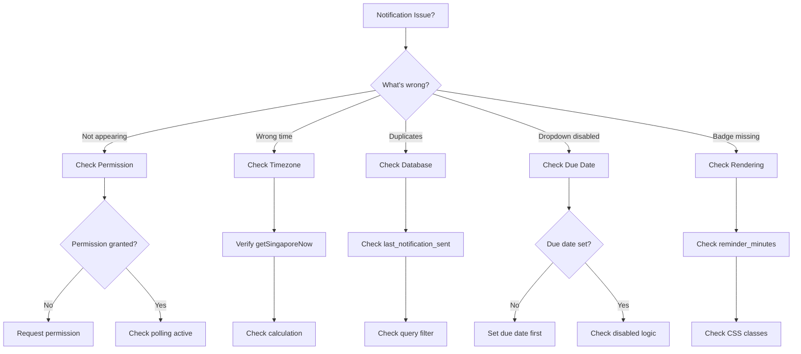

# Troubleshooting Guide: Reminders & Notifications (PRP 04)

## Quick Diagnosis



---

## Common Issues & Solutions

### Issue #1: Notifications Not Appearing

#### Symptom
Browser notification doesn't show up when expected

#### Diagnosis Steps

1. **Check Permission Status**
   ```javascript
   // In browser console
   console.log(Notification.permission);
   // Should be: "granted"
   ```

2. **Check Polling is Active**
   - Open browser DevTools → Network tab
   - Look for requests to `/api/notifications/check` every 60 seconds
   - If no requests: Hook not running or permission not granted

3. **Check API Response**
   ```bash
   # In terminal (replace cookie with actual session)
   curl -H "Cookie: session=your_session_token" \
     http://localhost:3000/api/notifications/check
   ```
   
   Expected response:
   ```json
   {"reminders": [{"id": 1, "title": "Todo", "due_date": "...", "reminder_minutes": 15}]}
   ```

4. **Check Database State**
   ```sql
   SELECT id, title, due_date, reminder_minutes, last_notification_sent 
   FROM todos 
   WHERE reminder_minutes IS NOT NULL AND completed = 0;
   ```

#### Solutions

**Solution A: Permission Not Granted**
```typescript
// Check in browser console
if (Notification.permission !== 'granted') {
  Notification.requestPermission();
}
```

**Solution B: Polling Not Started**
```typescript
// In app/page.tsx
const { permission } = useNotifications();
useNotificationPolling(permission === 'granted'); // ← Ensure this is called
```

**Solution C: Reminder Time Not Met**
- Verify: `due_date - reminder_minutes <= current_time`
- Example: Due at 14:00, reminder 15m before → should notify at 13:45

**Solution D: Browser Notifications Blocked in OS**
- **Windows**: Settings → System → Notifications → Check browser allowed
- **macOS**: System Preferences → Notifications → Check browser allowed
- **Linux**: Check notification settings in desktop environment

---

### Issue #2: Duplicate Notifications

#### Symptom
Same todo sends notification multiple times

#### Diagnosis

1. **Check Database**
   ```sql
   SELECT id, title, last_notification_sent 
   FROM todos 
   WHERE id = <your_todo_id>;
   ```
   
   If `last_notification_sent` is NULL after notification, there's a bug.

2. **Check API Logic**
   - Verify `todoDB.markNotificationSent()` is called
   - Verify update actually saves to database

3. **Check Query Filter**
   ```typescript
   // In lib/db.ts - getDueReminders()
   WHERE last_notification_sent IS NULL  // ← Must be in query
   ```

#### Solutions

**Solution A: Update Not Saving**
```typescript
// In app/api/notifications/check/route.ts
reminders.forEach(reminder => {
  todoDB.markNotificationSent(reminder.id, now.toISOString());
  // Add verification:
  console.log('Marked notification sent for todo', reminder.id);
});
```

**Solution B: Query Not Filtering**
```typescript
// In lib/db.ts
export const todoDB = {
  getDueReminders(userId: number, now: Date): Todo[] {
    const stmt = db.prepare(`
      SELECT * FROM todos 
      WHERE user_id = ? 
        AND completed = 0 
        AND reminder_minutes IS NOT NULL 
        AND last_notification_sent IS NULL  -- ← Critical!
        AND datetime(due_date, '-' || reminder_minutes || ' minutes') <= ?
    `);
    return stmt.all(userId, now.toISOString());
  }
};
```

**Solution C: Browser-Level Duplicates**
```typescript
// In lib/hooks/useNotifications.ts
const showNotification = (title: string, body: string, todoId: number) => {
  new Notification(title, {
    body,
    icon: '/favicon.ico',
    tag: `todo-${todoId}`,  // ← Prevents browser duplicates
  });
};
```

---

### Issue #3: Reminder Dropdown Disabled

#### Symptom
Cannot select reminder option when creating/editing todo

#### Diagnosis

1. **Check Due Date Set**
   - Reminder requires due date
   - Dropdown should have `disabled={!dueDate}` logic

2. **Check State**
   ```typescript
   // In browser console (React DevTools)
   // Find TodoForm component
   // Check dueDate state value
   ```

#### Solutions

**Solution: Ensure Due Date Required**
```tsx
// In app/page.tsx - TodoForm
<label>Due Date</label>
<input 
  type="datetime-local"
  value={dueDate}
  onChange={(e) => setDueDate(e.target.value)}
/>

<label>Reminder</label>
<select 
  value={reminderMinutes ?? ''}
  onChange={(e) => setReminderMinutes(e.target.value ? Number(e.target.value) : null)}
  disabled={!dueDate}  // ← This prevents selection without due date
>
  {REMINDER_OPTIONS.map(opt => (
    <option key={opt.label} value={opt.value ?? ''}>{opt.label}</option>
  ))}
</select>
```

**User Guidance**:
Add help text below reminder dropdown:
```tsx
{!dueDate && (
  <p className="text-sm text-gray-500">
    ⚠️ Set a due date to enable reminders
  </p>
)}
```

---

### Issue #4: Wrong Notification Time

#### Symptom
Notification appears too early or too late

#### Diagnosis

1. **Check Timezone Usage**
   ```typescript
   // In app/api/notifications/check/route.ts
   import { getSingaporeNow } from '@/lib/timezone';
   const now = getSingaporeNow(); // ← NOT new Date()
   ```

2. **Check Calculation**
   ```sql
   -- Test query
   SELECT 
     title,
     due_date,
     reminder_minutes,
     datetime(due_date, '-' || reminder_minutes || ' minutes') as notification_time,
     datetime('now', 'localtime') as current_time
   FROM todos 
   WHERE id = <your_todo_id>;
   ```

3. **Check Client vs Server Time**
   ```javascript
   // In browser console
   console.log('Client time:', new Date());
   
   // Compare with server time
   fetch('/api/notifications/check')
     .then(r => r.json())
     .then(data => console.log('Server time:', new Date()));
   ```

#### Solutions

**Solution A: Use Singapore Timezone Everywhere**
```typescript
// lib/timezone.ts
import { zonedTimeToUtc, utcToZonedTime, format } from 'date-fns-tz';

const SINGAPORE_TZ = 'Asia/Singapore';

export function getSingaporeNow(): Date {
  return utcToZonedTime(new Date(), SINGAPORE_TZ);
}

// In API route
const now = getSingaporeNow();
const reminders = todoDB.getDueReminders(userId, now);
```

**Solution B: Correct Reminder Calculation**
```typescript
// Formula: notification_time = due_date - reminder_minutes
const notificationTime = new Date(todo.due_date).getTime() - (todo.reminder_minutes * 60 * 1000);
const currentTime = getSingaporeNow().getTime();

if (currentTime >= notificationTime && !todo.last_notification_sent) {
  // Send notification
}
```

**Solution C: Handle UTC vs Local Time**
```typescript
// Store due_date in UTC in database
// Convert to Singapore time for comparison
const dueDateSG = utcToZonedTime(new Date(todo.due_date), 'Asia/Singapore');
const nowSG = getSingaporeNow();
```

---

### Issue #5: Badge Not Displaying

#### Symptom
🔔 badge doesn't appear on todo with reminder

#### Diagnosis

1. **Check reminder_minutes Value**
   ```sql
   SELECT id, title, reminder_minutes FROM todos WHERE id = <your_todo_id>;
   ```
   
   Should be: 15, 30, 60, 120, 1440, 2880, or 10080 (not NULL)

2. **Check Rendering Logic**
   ```typescript
   // In app/page.tsx - TodoItem
   {todo.reminder_minutes && (  // ← Must be truthy
     <span className="...">🔔 {formatReminderBadge(todo.reminder_minutes)}</span>
   )}
   ```

3. **Check formatReminderBadge Function**
   ```typescript
   function formatReminderBadge(minutes: number): string {
     if (minutes < 60) return `${minutes}m`;
     if (minutes < 1440) return `${minutes / 60}h`;
     if (minutes < 10080) return `${minutes / 1440}d`;
     return `${minutes / 10080}w`;
   }
   ```

#### Solutions

**Solution A: Fix Rendering Condition**
```tsx
// Check all sections: Overdue, Active, Completed
const TodoItem = ({ todo }: { todo: Todo }) => (
  <div>
    <span>{todo.title}</span>
    
    {/* Priority badge */}
    <span className="priority-badge">{todo.priority}</span>
    
    {/* Reminder badge */}
    {todo.reminder_minutes && todo.reminder_minutes > 0 && (
      <span className="text-xs bg-blue-100 text-blue-800 px-2 py-1 rounded-full">
        🔔 {formatReminderBadge(todo.reminder_minutes)}
      </span>
    )}
  </div>
);
```

**Solution B: Fix CSS Visibility**
```css
/* Ensure badge not hidden */
.reminder-badge {
  display: inline-flex;
  align-items: center;
  gap: 0.25rem;
  opacity: 1; /* Check if opacity: 0 somewhere */
  z-index: 1; /* Check if behind other elements */
}
```

**Solution C: Debug Render**
```typescript
// Temporary debug
{console.log('Todo reminder:', todo.reminder_minutes)}
{todo.reminder_minutes && (
  <span className="reminder-badge">
    🔔 {formatReminderBadge(todo.reminder_minutes)}
  </span>
)}
```

---

### Issue #6: Recurring Todo Not Inheriting Reminder

#### Symptom
Next instance of recurring todo doesn't have reminder

#### Diagnosis

1. **Check Completion Logic**
   ```typescript
   // In app/api/todos/[id]/route.ts - PUT handler
   if (todo.is_recurring && completed) {
     // Should create next instance
     const nextInstance = calculateNextInstance(todo);
     // Check if reminder_minutes copied
   }
   ```

2. **Check Database After Completion**
   ```sql
   SELECT id, title, due_date, reminder_minutes, is_recurring 
   FROM todos 
   WHERE title = '<your_recurring_todo>' 
   ORDER BY due_date DESC;
   ```

#### Solutions

**Solution: Copy Reminder to Next Instance**
```typescript
// In app/api/todos/[id]/route.ts
function createRecurringInstance(todo: Todo): Todo {
  const nextDueDate = calculateNextDueDate(todo.due_date, todo.recurrence_pattern);
  
  return todoDB.create({
    user_id: todo.user_id,
    title: todo.title,
    priority: todo.priority,
    due_date: nextDueDate,
    is_recurring: true,
    recurrence_pattern: todo.recurrence_pattern,
    reminder_minutes: todo.reminder_minutes,  // ← Copy reminder offset
    last_notification_sent: null,  // ← Reset to allow new notification
    completed: false,
  });
}
```

---

### Issue #7: Polling Stops After Tab Switch

#### Symptom
Notifications stop when switching to another tab or minimizing

#### Diagnosis

1. **Check Interval Cleanup**
   ```typescript
   // In lib/hooks/useNotificationPolling.ts
   useEffect(() => {
     // ...
     return () => clearInterval(intervalId); // ← Should NOT clear on tab switch
   }, [enabled]);
   ```

2. **Check Browser Tab Throttling**
   - Modern browsers throttle background tabs
   - Polling may slow down but shouldn't stop

#### Solutions

**Solution A: Polling Continues in Background**
```typescript
// This is expected behavior - polling should continue
// Browsers may throttle to 1 poll per minute (acceptable)

useEffect(() => {
  if (!enabled) return;
  
  const check = async () => {
    try {
      const res = await fetch('/api/notifications/check');
      const { reminders } = await res.json();
      // Show notifications (works even if tab backgrounded)
    } catch (error) {
      console.error('Polling error:', error);
    }
  };
  
  check(); // Immediate
  const id = setInterval(check, 60000);
  
  return () => clearInterval(id); // Only on unmount, not tab switch
}, [enabled]);
```

**Solution B: Use Visibility API (Advanced)**
```typescript
useEffect(() => {
  if (!enabled) return;
  
  const check = async () => { /* ... */ };
  
  // Check on visibility change
  const handleVisibilityChange = () => {
    if (document.visibilityState === 'visible') {
      check(); // Immediate check when tab becomes visible
    }
  };
  
  document.addEventListener('visibilitychange', handleVisibilityChange);
  
  check();
  const id = setInterval(check, 60000);
  
  return () => {
    clearInterval(id);
    document.removeEventListener('visibilitychange', handleVisibilityChange);
  };
}, [enabled]);
```

---

### Issue #8: Performance Degradation

#### Symptom
App becomes slow after enabling notifications

#### Diagnosis

1. **Check Query Performance**
   ```sql
   EXPLAIN QUERY PLAN
   SELECT * FROM todos 
   WHERE user_id = 1 
     AND completed = 0 
     AND reminder_minutes IS NOT NULL 
     AND datetime(due_date, '-' || reminder_minutes || ' minutes') <= datetime('now');
   ```
   
   Should use index: `idx_todos_reminder`

2. **Check Memory Leaks**
   - Open browser DevTools → Performance → Record
   - Enable notifications and let run for 5 minutes
   - Stop recording and check memory timeline (should be flat)

3. **Check Network Overhead**
   - DevTools → Network tab
   - Monitor size and frequency of `/api/notifications/check` requests

#### Solutions

**Solution A: Add Database Index**
```sql
CREATE INDEX idx_todos_reminder ON todos(reminder_minutes, due_date) 
  WHERE reminder_minutes IS NOT NULL AND completed = 0;
```

**Solution B: Limit Result Set**
```typescript
// In lib/db.ts
export const todoDB = {
  getDueReminders(userId: number, now: Date, limit = 5): Todo[] {
    const stmt = db.prepare(`
      SELECT * FROM todos 
      WHERE user_id = ? 
        AND completed = 0 
        AND reminder_minutes IS NOT NULL 
        AND last_notification_sent IS NULL
        AND datetime(due_date, '-' || reminder_minutes || ' minutes') <= ?
      LIMIT ?  -- Prevent notification spam
    `);
    return stmt.all(userId, now.toISOString(), limit);
  }
};
```

**Solution C: Debounce Polling**
```typescript
// Only poll when tab is active (optional optimization)
useEffect(() => {
  if (!enabled || document.hidden) return;
  
  // ... polling logic
}, [enabled]);
```

---

### Issue #9: Permission Denied but Button Still Shows "Enable"

#### Symptom
User denied permission but button state doesn't update

#### Diagnosis

1. **Check Permission State Sync**
   ```typescript
   // In lib/hooks/useNotifications.ts
   const [permission, setPermission] = useState<NotificationPermission>('default');
   
   useEffect(() => {
     setPermission(Notification.permission);
   }, []);
   ```

2. **Check requestPermission Updates State**
   ```typescript
   const requestPermission = async () => {
     const result = await Notification.requestPermission();
     setPermission(result);  // ← Must update state
     return result;
   };
   ```

#### Solutions

**Solution: Sync Permission State**
```typescript
export function useNotifications() {
  const [permission, setPermission] = useState<NotificationPermission>('default');
  
  useEffect(() => {
    if ('Notification' in window) {
      setPermission(Notification.permission);
    }
  }, []);
  
  const requestPermission = async () => {
    if (!('Notification' in window)) {
      return 'denied';
    }
    
    const result = await Notification.requestPermission();
    setPermission(result);  // Update React state
    return result;
  };
  
  return { permission, requestPermission, showNotification };
}
```

**Button Component**:
```tsx
const { permission, requestPermission } = useNotifications();

<button
  onClick={requestPermission}
  disabled={permission !== 'default'}  // Disable if already decided
  className={cn(
    'px-4 py-2 rounded',
    permission === 'granted' && 'bg-green-500',
    permission === 'denied' && 'bg-red-500',
    permission === 'default' && 'bg-orange-500'
  )}
>
  🔔 {
    permission === 'granted' ? 'Notifications On' :
    permission === 'denied' ? 'Notifications Blocked' :
    'Enable Notifications'
  }
</button>
```

---

## Debugging Tools & Commands

### Browser Console Commands

```javascript
// Check permission
Notification.permission

// Request permission manually
Notification.requestPermission().then(console.log)

// Test notification
new Notification('Test', { body: 'This is a test' })

// Check if polling active (look for logs)
// Add this to useNotificationPolling:
console.log('[Polling] Checking reminders...', new Date())

// Manually trigger API check
fetch('/api/notifications/check')
  .then(r => r.json())
  .then(console.log)
```

### SQLite Database Commands

```bash
# Open database
sqlite3 todos.db

# Check schema
.schema todos

# Check todos with reminders
SELECT id, title, due_date, reminder_minutes, last_notification_sent 
FROM todos 
WHERE reminder_minutes IS NOT NULL;

# Check index exists
.indexes todos

# Reset notifications for testing
UPDATE todos SET last_notification_sent = NULL WHERE id = <your_todo_id>;

# Check due reminders (manual calculation)
SELECT 
  id, 
  title, 
  datetime(due_date, '-' || reminder_minutes || ' minutes') as notify_at,
  datetime('now') as current_time
FROM todos 
WHERE reminder_minutes IS NOT NULL AND completed = 0;
```

### Network Debugging

```bash
# Monitor API calls
# In browser DevTools → Network → Filter: "notifications"

# Manual API test
curl -H "Cookie: session=<your_session>" \
  http://localhost:3000/api/notifications/check

# Check response time
curl -w "@curl-format.txt" -o /dev/null -s \
  -H "Cookie: session=<your_session>" \
  http://localhost:3000/api/notifications/check
```

---

## Getting Help

### Before Reporting Issues

- [ ] Check this troubleshooting guide
- [ ] Review `IMPLEMENTATION_PLAN_PRP04.md`
- [ ] Check browser console for errors
- [ ] Verify database schema matches spec
- [ ] Test in different browser

### Reporting Template

```markdown
**Issue**: [Brief description]

**Expected Behavior**: [What should happen]

**Actual Behavior**: [What actually happens]

**Steps to Reproduce**:
1. 
2. 
3. 

**Environment**:
- Browser: [Chrome 120, Firefox 122, etc.]
- OS: [Windows 11, macOS 14, Ubuntu 22.04]
- Node version: [20.10.0]
- Database records: [Number of todos with reminders]

**Console Errors**: [Paste any errors]

**Database State**: 
```sql
SELECT * FROM todos WHERE id = <affected_todo_id>;
```

**Screenshots**: [Attach if relevant]
```

---

## Quick Reference: Common Fixes

| Problem | Quick Fix |
|---------|-----------|
| No notifications | Check `Notification.permission` |
| Dropdown disabled | Set due date first |
| Wrong time | Use `getSingaporeNow()` |
| Duplicates | Check `last_notification_sent` set |
| Badge missing | Verify `reminder_minutes > 0` |
| Polling stopped | Check `useEffect` cleanup |
| Slow performance | Add database index |
| Permission stuck | Reload page after grant/deny |

---

**Created**: 2026-02-06  
**Version**: 1.0  
**Based on**: PRPs/04-reminders-notifications.md  
**Last Updated**: 2026-02-06
